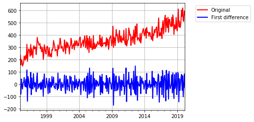

# Multivariate forecasting of sexual crimes in NSW

Python code to perform multivariate forecasting of sexual crimes in NSW based on data from the NSW Bureau of Crime Statistics and Research.

# Loading libraries

Let's load relevant Python libraries.


```python
import numpy as np 
import pandas as pd 
import seaborn as sns 
import matplotlib.pyplot as plt 
import matplotlib as mpl
import keras
import itertools
import datetime
from dateutil.relativedelta import *
from IPython.display import display, Markdown
import pmdarima as pm
import statsmodels.api as sm
from contextlib import contextmanager
import sys, os
import warnings
warnings.filterwarnings("ignore")
```

# Loading data

The original data acquired from https://www.bocsar.nsw.gov.au/Pages/bocsar_datasets/Datasets-.aspxNSW. It contains monthly data on all criminal incidents recorded by police from 1995 to Mar 2020. It was processed and cleaned in another notebook. Now we are going to use the processed file.


```python
data = pd.read_csv('crimes_nsw.csv', index_col=0, parse_dates=True)
```


```python
data.head()
```


<div>
<table border="1" class="dataframe">
  <thead>
    <tr style="text-align: right;">
      <th></th>
      <th>Murder</th>
      <th>Attempted murder</th>
      <th>Murder accessory, conspiracy</th>
      <th>Manslaughter</th>
      <th>Domestic violence related assault</th>
      <th>Non-domestic violence related assault</th>
      <th>Assault Police</th>
      <th>Sexual assault</th>
      <th>Indecent assault, act of indecency and other sexual offences</th>
      <th>Abduction and kidnapping</th>
      <th>...</th>
      <th>Pornography offences</th>
      <th>Prostitution offences</th>
      <th>Escape custody</th>
      <th>Breach Apprehended Violence Order</th>
      <th>Breach bail conditions</th>
      <th>Fail to appear</th>
      <th>Resist or hinder officer</th>
      <th>Other offences against justice procedures</th>
      <th>Transport regulatory offences</th>
      <th>Other offences</th>
    </tr>
  </thead>
  <tbody>
    <tr>
      <th>1995-01-01</th>
      <td>9</td>
      <td>1</td>
      <td>0</td>
      <td>0</td>
      <td>613</td>
      <td>2416</td>
      <td>196</td>
      <td>237</td>
      <td>394</td>
      <td>15</td>
      <td>...</td>
      <td>2</td>
      <td>49</td>
      <td>36</td>
      <td>266</td>
      <td>135</td>
      <td>141</td>
      <td>397</td>
      <td>301</td>
      <td>40</td>
      <td>596</td>
    </tr>
    <tr>
      <th>1995-02-01</th>
      <td>11</td>
      <td>3</td>
      <td>2</td>
      <td>2</td>
      <td>591</td>
      <td>2277</td>
      <td>177</td>
      <td>157</td>
      <td>350</td>
      <td>16</td>
      <td>...</td>
      <td>3</td>
      <td>17</td>
      <td>29</td>
      <td>241</td>
      <td>115</td>
      <td>143</td>
      <td>347</td>
      <td>294</td>
      <td>57</td>
      <td>516</td>
    </tr>
    <tr>
      <th>1995-03-01</th>
      <td>10</td>
      <td>4</td>
      <td>0</td>
      <td>1</td>
      <td>625</td>
      <td>2379</td>
      <td>181</td>
      <td>199</td>
      <td>438</td>
      <td>23</td>
      <td>...</td>
      <td>4</td>
      <td>35</td>
      <td>34</td>
      <td>292</td>
      <td>144</td>
      <td>135</td>
      <td>338</td>
      <td>387</td>
      <td>57</td>
      <td>560</td>
    </tr>
    <tr>
      <th>1995-04-01</th>
      <td>11</td>
      <td>6</td>
      <td>0</td>
      <td>2</td>
      <td>640</td>
      <td>2160</td>
      <td>177</td>
      <td>188</td>
      <td>341</td>
      <td>22</td>
      <td>...</td>
      <td>1</td>
      <td>52</td>
      <td>24</td>
      <td>285</td>
      <td>131</td>
      <td>121</td>
      <td>322</td>
      <td>304</td>
      <td>53</td>
      <td>492</td>
    </tr>
    <tr>
      <th>1995-05-01</th>
      <td>7</td>
      <td>5</td>
      <td>2</td>
      <td>1</td>
      <td>602</td>
      <td>2128</td>
      <td>131</td>
      <td>148</td>
      <td>346</td>
      <td>14</td>
      <td>...</td>
      <td>3</td>
      <td>35</td>
      <td>23</td>
      <td>286</td>
      <td>139</td>
      <td>158</td>
      <td>289</td>
      <td>386</td>
      <td>86</td>
      <td>616</td>
    </tr>
  </tbody>
</table>
<p>5 rows × 62 columns</p>
</div>


# Correlation analysis


```python
corr = data.corr()
```


```python
corr.head()
```


<div>
<table border="1" class="dataframe">
  <thead>
    <tr style="text-align: right;">
      <th></th>
      <th>Murder</th>
      <th>Attempted murder</th>
      <th>Murder accessory, conspiracy</th>
      <th>Manslaughter</th>
      <th>Domestic violence related assault</th>
      <th>Non-domestic violence related assault</th>
      <th>Assault Police</th>
      <th>Sexual assault</th>
      <th>Indecent assault, act of indecency and other sexual offences</th>
      <th>Abduction and kidnapping</th>
      <th>...</th>
      <th>Pornography offences</th>
      <th>Prostitution offences</th>
      <th>Escape custody</th>
      <th>Breach Apprehended Violence Order</th>
      <th>Breach bail conditions</th>
      <th>Fail to appear</th>
      <th>Resist or hinder officer</th>
      <th>Other offences against justice procedures</th>
      <th>Transport regulatory offences</th>
      <th>Other offences</th>
    </tr>
  </thead>
  <tbody>
    <tr>
      <th>Murder</th>
      <td>1.000000</td>
      <td>0.365231</td>
      <td>0.138157</td>
      <td>0.053442</td>
      <td>-0.289604</td>
      <td>0.120521</td>
      <td>0.147452</td>
      <td>-0.379037</td>
      <td>-0.210921</td>
      <td>0.169820</td>
      <td>...</td>
      <td>-0.403237</td>
      <td>0.238803</td>
      <td>0.337264</td>
      <td>-0.308997</td>
      <td>-0.405640</td>
      <td>0.376940</td>
      <td>-0.049425</td>
      <td>0.311993</td>
      <td>-0.422865</td>
      <td>-0.196618</td>
    </tr>
    <tr>
      <th>Attempted murder</th>
      <td>0.365231</td>
      <td>1.000000</td>
      <td>0.252897</td>
      <td>0.194512</td>
      <td>-0.382778</td>
      <td>0.331245</td>
      <td>0.341831</td>
      <td>-0.507649</td>
      <td>-0.349312</td>
      <td>0.359998</td>
      <td>...</td>
      <td>-0.599237</td>
      <td>0.424611</td>
      <td>0.616458</td>
      <td>-0.354095</td>
      <td>-0.638149</td>
      <td>0.562178</td>
      <td>0.035280</td>
      <td>0.386166</td>
      <td>-0.610551</td>
      <td>-0.122431</td>
    </tr>
    <tr>
      <th>Murder accessory, conspiracy</th>
      <td>0.138157</td>
      <td>0.252897</td>
      <td>1.000000</td>
      <td>-0.003660</td>
      <td>-0.112756</td>
      <td>0.114272</td>
      <td>0.092305</td>
      <td>-0.192342</td>
      <td>-0.174581</td>
      <td>0.168598</td>
      <td>...</td>
      <td>-0.211005</td>
      <td>0.103580</td>
      <td>0.161519</td>
      <td>-0.138872</td>
      <td>-0.226745</td>
      <td>0.150228</td>
      <td>0.018631</td>
      <td>0.084419</td>
      <td>-0.215765</td>
      <td>-0.017777</td>
    </tr>
    <tr>
      <th>Manslaughter</th>
      <td>0.053442</td>
      <td>0.194512</td>
      <td>-0.003660</td>
      <td>1.000000</td>
      <td>-0.137801</td>
      <td>0.076565</td>
      <td>0.110997</td>
      <td>-0.127899</td>
      <td>-0.045221</td>
      <td>0.100293</td>
      <td>...</td>
      <td>-0.185314</td>
      <td>0.199467</td>
      <td>0.223375</td>
      <td>-0.127315</td>
      <td>-0.200212</td>
      <td>0.218109</td>
      <td>-0.016614</td>
      <td>0.215255</td>
      <td>-0.211501</td>
      <td>-0.106784</td>
    </tr>
    <tr>
      <th>Domestic violence related assault</th>
      <td>-0.289604</td>
      <td>-0.382778</td>
      <td>-0.112756</td>
      <td>-0.137801</td>
      <td>1.000000</td>
      <td>0.268514</td>
      <td>0.329355</td>
      <td>0.701932</td>
      <td>0.494574</td>
      <td>-0.102251</td>
      <td>...</td>
      <td>0.623767</td>
      <td>-0.430343</td>
      <td>-0.526837</td>
      <td>0.915471</td>
      <td>0.753355</td>
      <td>-0.654952</td>
      <td>0.623879</td>
      <td>-0.709158</td>
      <td>0.701029</td>
      <td>0.771534</td>
    </tr>
  </tbody>
</table>
<p>5 rows × 62 columns</p>
</div>


Lets find other crimes that are correlated with sexual crimes. For more information on correlation analysis of crimes, refer to my other notebook.


```python
threshold = 0.8
column='Sexual assault'
targetcolumn = corr[column]
filteredcolumn = targetcolumn[((targetcolumn>threshold) & (targetcolumn<1))|
                                  ((targetcolumn<-threshold) & (targetcolumn>-1))]
    

if len(filteredcolumn)==0:
    display(Markdown('None'))
else:
    print(filteredcolumn)
    print('')
    print('')
    np.random.seed(53)
    colors = np.random.choice(list(mpl.colors.XKCD_COLORS.keys()), len(filteredcolumn)+1, replace=False)
    data[column].plot(kind = 'line', color = colors[0],label = column,linewidth=2,alpha = 1,grid = True,linestyle = '-')
    i=1
    for index, value in list(filteredcolumn.items()):            
        data[index].plot(kind = 'line', color = colors[i],label = index,linewidth=2,alpha = 1,grid = True,linestyle = '-')
        i=i+1
    plt.legend(loc='upper right')     
    plt.legend(bbox_to_anchor=(1.05, 1))   
    plt.xlabel('')              
    plt.ylabel('Number of cases')
    plt.title('Crimes correlated with '+ column.lower())            
    plt.show()
                
    for index, value in list(filteredcolumn.items()): 
        print('')    
        display(Markdown("### Relationship between '"+ column + "' and '" + index + "'" ))
        if value > 0:
            if value > threshold * 1.125:
                print('There is a strong positive correlation with a coefficient of ' + str(value) + ".")
            else:
                print('There is a somewhat a weak positive correlation with a coefficient of ' + str(value) + ".")
        else:
            if value > threshold * -1.125:                    
                print('There is a strong negative correlation with a coefficient of ' + str(-value) + '.')
            else:
                print('There is a somewhat a weak negative correlation with a coefficient of ' + str(-value) + ".")
                
        sns.jointplot(x=column, y=index, data=data, kind="kde")  
        plt.show()             
print('')   
print('')
print('')
            
   
   
```

    Intimidation, stalking and harassment    0.820628
    Fraud                                    0.813483
    Possession and/or use of other drugs     0.845602
    Other drug offences                      0.809643
    Pornography offences                     0.816202
    Breach Apprehended Violence Order        0.802285
    Breach bail conditions                   0.836366
    Transport regulatory offences            0.824175
    Name: Sexual assault, dtype: float64
    
    
    


    
    


### Relationship between 'Sexual assault' and 'Intimidation, stalking and harassment'


    There is a somewhat a weak positive correlation with a coefficient of 0.8206279836753958.
    


    
    


### Relationship between 'Sexual assault' and 'Fraud'


    There is a somewhat a weak positive correlation with a coefficient of 0.813483306158548.
    


    
    


### Relationship between 'Sexual assault' and 'Possession and/or use of other drugs'


    There is a somewhat a weak positive correlation with a coefficient of 0.8456016331276149.
    


    
    


### Relationship between 'Sexual assault' and 'Other drug offences'


    There is a somewhat a weak positive correlation with a coefficient of 0.8096427611461977.
    


    
    


### Relationship between 'Sexual assault' and 'Pornography offences'


    There is a somewhat a weak positive correlation with a coefficient of 0.8162018238764369.
    


    
    


### Relationship between 'Sexual assault' and 'Breach Apprehended Violence Order'


    There is a somewhat a weak positive correlation with a coefficient of 0.8022849930996498.
    


    
    


### Relationship between 'Sexual assault' and 'Breach bail conditions'


    There is a somewhat a weak positive correlation with a coefficient of 0.8363661185268287.
    


    
    


### Relationship between 'Sexual assault' and 'Transport regulatory offences'


    There is a somewhat a weak positive correlation with a coefficient of 0.8241745573416319.
    


    
    
    
    

# Forecasting using machine learning

Let's use a recurrent neural network with gated recurrent units in the first layer.

### Data Preprocessing and Preparation

Since the time series are not stationary, let's take the first order difference of all the time series.


```python
data_diff = data.diff().iloc[1:] #take the first difference and then ignore the first row (NA's)
```


```python
data_diff.head()
```


<div>
<table border="1" class="dataframe">
  <thead>
    <tr style="text-align: right;">
      <th></th>
      <th>Murder</th>
      <th>Attempted murder</th>
      <th>Murder accessory, conspiracy</th>
      <th>Manslaughter</th>
      <th>Domestic violence related assault</th>
      <th>Non-domestic violence related assault</th>
      <th>Assault Police</th>
      <th>Sexual assault</th>
      <th>Indecent assault, act of indecency and other sexual offences</th>
      <th>Abduction and kidnapping</th>
      <th>...</th>
      <th>Pornography offences</th>
      <th>Prostitution offences</th>
      <th>Escape custody</th>
      <th>Breach Apprehended Violence Order</th>
      <th>Breach bail conditions</th>
      <th>Fail to appear</th>
      <th>Resist or hinder officer</th>
      <th>Other offences against justice procedures</th>
      <th>Transport regulatory offences</th>
      <th>Other offences</th>
    </tr>
  </thead>
  <tbody>
    <tr>
      <th>1995-02-01</th>
      <td>2.0</td>
      <td>2.0</td>
      <td>2.0</td>
      <td>2.0</td>
      <td>-22.0</td>
      <td>-139.0</td>
      <td>-19.0</td>
      <td>-80.0</td>
      <td>-44.0</td>
      <td>1.0</td>
      <td>...</td>
      <td>1.0</td>
      <td>-32.0</td>
      <td>-7.0</td>
      <td>-25.0</td>
      <td>-20.0</td>
      <td>2.0</td>
      <td>-50.0</td>
      <td>-7.0</td>
      <td>17.0</td>
      <td>-80.0</td>
    </tr>
    <tr>
      <th>1995-03-01</th>
      <td>-1.0</td>
      <td>1.0</td>
      <td>-2.0</td>
      <td>-1.0</td>
      <td>34.0</td>
      <td>102.0</td>
      <td>4.0</td>
      <td>42.0</td>
      <td>88.0</td>
      <td>7.0</td>
      <td>...</td>
      <td>1.0</td>
      <td>18.0</td>
      <td>5.0</td>
      <td>51.0</td>
      <td>29.0</td>
      <td>-8.0</td>
      <td>-9.0</td>
      <td>93.0</td>
      <td>0.0</td>
      <td>44.0</td>
    </tr>
    <tr>
      <th>1995-04-01</th>
      <td>1.0</td>
      <td>2.0</td>
      <td>0.0</td>
      <td>1.0</td>
      <td>15.0</td>
      <td>-219.0</td>
      <td>-4.0</td>
      <td>-11.0</td>
      <td>-97.0</td>
      <td>-1.0</td>
      <td>...</td>
      <td>-3.0</td>
      <td>17.0</td>
      <td>-10.0</td>
      <td>-7.0</td>
      <td>-13.0</td>
      <td>-14.0</td>
      <td>-16.0</td>
      <td>-83.0</td>
      <td>-4.0</td>
      <td>-68.0</td>
    </tr>
    <tr>
      <th>1995-05-01</th>
      <td>-4.0</td>
      <td>-1.0</td>
      <td>2.0</td>
      <td>-1.0</td>
      <td>-38.0</td>
      <td>-32.0</td>
      <td>-46.0</td>
      <td>-40.0</td>
      <td>5.0</td>
      <td>-8.0</td>
      <td>...</td>
      <td>2.0</td>
      <td>-17.0</td>
      <td>-1.0</td>
      <td>1.0</td>
      <td>8.0</td>
      <td>37.0</td>
      <td>-33.0</td>
      <td>82.0</td>
      <td>33.0</td>
      <td>124.0</td>
    </tr>
    <tr>
      <th>1995-06-01</th>
      <td>3.0</td>
      <td>-4.0</td>
      <td>-2.0</td>
      <td>-1.0</td>
      <td>6.0</td>
      <td>9.0</td>
      <td>15.0</td>
      <td>12.0</td>
      <td>-30.0</td>
      <td>-1.0</td>
      <td>...</td>
      <td>0.0</td>
      <td>-7.0</td>
      <td>-3.0</td>
      <td>10.0</td>
      <td>-16.0</td>
      <td>16.0</td>
      <td>-7.0</td>
      <td>-57.0</td>
      <td>-20.0</td>
      <td>-72.0</td>
    </tr>
  </tbody>
</table>
<p>5 rows × 62 columns</p>
</div>


```python
a = data.loc[:, columns]
```


```python
a.head()
```


<div>
<table border="1" class="dataframe">
  <thead>
    <tr style="text-align: right;">
      <th></th>
      <th>Sexual assault</th>
      <th>Intimidation, stalking and harassment</th>
      <th>Fraud</th>
      <th>Possession and/or use of other drugs</th>
      <th>Other drug offences</th>
      <th>Pornography offences</th>
      <th>Breach Apprehended Violence Order</th>
      <th>Breach bail conditions</th>
      <th>Transport regulatory offences</th>
    </tr>
  </thead>
  <tbody>
    <tr>
      <th>1995-01-01</th>
      <td>237</td>
      <td>346</td>
      <td>1256</td>
      <td>25</td>
      <td>179</td>
      <td>2</td>
      <td>266</td>
      <td>135</td>
      <td>40</td>
    </tr>
    <tr>
      <th>1995-02-01</th>
      <td>157</td>
      <td>331</td>
      <td>1229</td>
      <td>23</td>
      <td>192</td>
      <td>3</td>
      <td>241</td>
      <td>115</td>
      <td>57</td>
    </tr>
    <tr>
      <th>1995-03-01</th>
      <td>199</td>
      <td>433</td>
      <td>1637</td>
      <td>23</td>
      <td>206</td>
      <td>4</td>
      <td>292</td>
      <td>144</td>
      <td>57</td>
    </tr>
    <tr>
      <th>1995-04-01</th>
      <td>188</td>
      <td>416</td>
      <td>1541</td>
      <td>27</td>
      <td>195</td>
      <td>1</td>
      <td>285</td>
      <td>131</td>
      <td>53</td>
    </tr>
    <tr>
      <th>1995-05-01</th>
      <td>148</td>
      <td>476</td>
      <td>1329</td>
      <td>36</td>
      <td>206</td>
      <td>3</td>
      <td>286</td>
      <td>139</td>
      <td>86</td>
    </tr>
  </tbody>
</table>
</div>


```python

data['Sexual assault'].plot(kind = 'line', label='Original', color ='red',linewidth=2,alpha = 1,grid = True,linestyle = '-')
data_diff['Sexual assault'].plot(kind = 'line', label='First difference', color ='blue',linewidth=2,alpha = 1,grid = True,linestyle = '-')
plt.legend(loc='upper right')     
plt.legend(bbox_to_anchor=(1.05, 1))   
plt.show()
```





Time series data need to be converted into 'supervised' data. The following function accepts a dataset in a time series form and spits out the dataset in supervised form.


```python
def BuildSupervisedData(dataset, columns, dim, targetcolumn):
    """
    The following function accepts a dataset in a time series form and spits out the dataset in supervised form.
    
    Parameters
    ----------
    dataset : Pandas DataFrame 
        Multivariate time series where rows are time stamps and columns are variables
    
    columns : List of str
        List of columns that we are interested input
    
    dim : List of int
        Corresponding dimensions for the columns. The size of the list must match columns.
        The dimension of a variable means how many past values are to be used to predict the next time step.abs
        
    targetcolumn : str
        The target column for Y.
        
    returns
    -------
        X and Y:  numpy arrays    
    
    """
    if (isinstance(dim, int)):
        dim = [dim] * len(columns)    
    width = sum(dim)    
    
    X = np.zeros((len(dataset)-max(dim), width, 1))  #Keras requires 3D array
    Y = np.zeros(len(dataset)-max(dim))

    row_index = 0
    for i in range(max(dim), len(dataset)):
        col_index = 0
        for j in range(len(columns)):
            for k in range(dim[j]):
                X[row_index, col_index, 0] = dataset[columns[j]][i-dim[j]+k]
                col_index=col_index + 1
        Y[row_index] = dataset[targetcolumn][i]        
        row_index = row_index + 1
    return X, Y 

```

Let's divide the dataset into 3 sets:
1. Training set (all the samples except the last 24 + 12 samples)
2. Validation set (24 samples)
3. Test set (the last 12 samples)


```python
def BuildTrainingValiTestData(X, Y):
    trainX = X[:-36, :, :]
    trainY = Y[:-36]
    valiX = X[-36:-12, :, :]
    valiY = Y[-36:-12]
    testX = X[-12:, :, :]
    testY = Y[-12:]
    return trainX, trainY, valiX, valiY, testX, testY

```


```python
def RMSE(predictions, targets=0):
    if (isinstance(targets, int)):
        targets = np.zeros(predictions.shape[0])
    return np.sqrt(np.mean((predictions-targets)**2))
```


```python
def GetValidationError(dataset, columns, dim, targetcolumn):
    x, y = BuildSupervisedData(dataset, columns, dim, targetcolumn)
    trainX, trainY, valiX, valiY, testX, testY = BuildTrainingValiTestData(x, y)
    
    model = keras.models.Sequential()
    model.add(keras.layers.GRU(10, input_shape=(trainX.shape[1], trainX.shape[2])))#, return_sequences=True
    model.add(keras.layers.Dense(5))
    model.add(keras.layers.Dense(1))
    model.compile(loss='mean_squared_error', optimizer='adam')
    model.fit(trainX, trainY, epochs=250, batch_size=1, verbose=0)
    
    predictions = model.predict(valiX)    
    return RMSE(predictions, valiY)
```

### Univariate forecasting

RMSE can be a misleading metric on its own. We need to gauge it with a benchmark. We need to measure the RMSE of a prediction system that simply predicts the next value to be the current value.


```python
baseline_RMSE = RMSE(valiY)
print(baseline_RMSE)
```

    77.31106001084191
    

Any prediction system needs to achieve lower than baseline RMSE of <font color="red">77.311</font>

Let's perform univariate forecasting of 'Sexual assault' using a range of past values (from 1 to 15)


```python
results = []
for i in range(1, 16):
    error = GetValidationError(data_diff, ['Sexual assault'], i, 'Sexual assault')
    results.append(error)
    print("Using", i, "past values produces RMSE", error)

```

    Root mean square error =  87.97941269946821
    Using 1 past values produces RMSE 87.97941269946821
    Root mean square error =  88.1742013169468
    Using 2 past values produces RMSE 88.1742013169468
    Root mean square error =  89.4366366695307
    Using 3 past values produces RMSE 89.4366366695307
    Root mean square error =  90.61822516721713
    Using 4 past values produces RMSE 90.61822516721713
    Root mean square error =  96.38797111578717
    Using 5 past values produces RMSE 96.38797111578717
    Root mean square error =  93.98260556703246
    Using 6 past values produces RMSE 93.98260556703246
    Root mean square error =  101.80130416066105
    Using 7 past values produces RMSE 101.80130416066105
    Root mean square error =  98.30906055775829
    Using 8 past values produces RMSE 98.30906055775829
    Root mean square error =  97.7742126348802
    Using 9 past values produces RMSE 97.7742126348802
    Root mean square error =  94.42634582540443
    Using 10 past values produces RMSE 94.42634582540443
    Root mean square error =  97.21603450928929
    Using 11 past values produces RMSE 97.21603450928929
    Root mean square error =  92.48617451681338
    Using 12 past values produces RMSE 92.48617451681338
    Root mean square error =  97.09105342131208
    Using 13 past values produces RMSE 97.09105342131208
    Root mean square error =  96.85769567541773
    Using 14 past values produces RMSE 96.85769567541773
    Root mean square error =  93.89835400541998
    Using 15 past values produces RMSE 93.89835400541998
    

The results are not good. The RMSE is directly proportional to the number of past values. This is probably due to overfitting since there are less than 300 training samples. The RMSE values are all higher than the baseline RMSE.


```python
plt.plot(range(1, 16), results)
plt.xlabel('Number of time steps from history used to predict future')              
plt.ylabel('RMSE')
plt.title('Performance of univariate forecasting')            
plt.show()
```


### Multivariate forecasting

Let's use all the exogenous variables to perform forecasting.


```python
for i in range(1,4):
    error = GetValidationError(data_diff, ['Sexual assault', 
                                           'Intimidation, stalking and harassment',
                                        'Fraud',
                                        'Possession and/or use of other drugs',
                                        'Other drug offences',
                                        'Pornography offences',
                                        'Breach Apprehended Violence Order',
                                        'Breach bail conditions',
                                        'Transport regulatory offences'],
                               i, 'Sexual assault')
    print("Using", i, "past time step(s):", error)


```

    Using 1 past time step(s) 86.46160112194339
    Using 2 past time step(s) 77.68331785158662
    Using 3 past time step(s) 77.31300486155607
    

Still above the baseline error rate.

Let's use pairs of exogenous variables.


```python
columns = ['Sexual assault', 
           'Intimidation, stalking and harassment',
           'Fraud',
           'Possession and/or use of other drugs',
           'Other drug offences',
           'Pornography offences',
           'Breach Apprehended Violence Order',
           'Breach bail conditions',
           'Transport regulatory offences']

for column in columns:
    if column!='Sexual assault':
        exogenous = ['Sexual assault', column]
        error = GetValidationError(data_diff,exogenous, 3, 'Sexual assault')
        print("Exogenous=" + column + ":", error)
```

    Exogenous=Intimidation, stalking and harassment: 77.94496301752756
    Exogenous=Fraud: 81.41128328248632
    Exogenous=Possession and/or use of other drugs: 93.09056959434457
    Exogenous=Other drug offences: 88.7343791605059
    Exogenous=Pornography offences: 100.59177765967793
    Exogenous=Breach Apprehended Violence Order: 84.37987922758248
    Exogenous=Breach bail conditions: 77.52078353043798
    Exogenous=Transport regulatory offences: 79.22511897898369
    

Since the results are not good. Let's just try statistical forecasting techniques.

# Forecasting using statistical techniques

### Univariate forecasting

Let's divide the dataset into 3 sets:
1. Training set (all the samples except the last 24 + 12 samples)
2. Validation set (24 samples)
3. Test set (the last 12 samples)


```python
def Evaluate(exog_list):
    
    endog = data['Sexual assault'].iloc[1:-36]
    exog =  data[exog_list].iloc[:-37].to_numpy()
    
    validation_endog = data['Sexual assault'].iloc[-35:-12]
    validation_exog = data[exog_list].iloc[-36:-13].to_numpy()
    
    optimization = pm.auto_arima(y=endog, exogenous=exog, 
                             start_p=1, max_p=24,
                             start_q=1, max_q=24,   
                             start_d=1, max_d=24, 
                             start_P=0, max_P=24,
                             start_Q=0, max_Q=24,
                             start_D=1, max_D=24, 
                             m=12,                                                      
                             seasonal=True,
                             trace=True,
                             error_action='ignore',  
                             suppress_warnings=True, 
                             stepwise=True)
    
    model = sm.tsa.statespace.SARIMAX(endog=endog, exog = exog,
                                  order=optimization.order,
                                  seasonal_order=optimization.seasonal_order,
                                  trend='c')

    residue = model.fit(disp=False)
    predictions = residue.forecast(23, exog=validation_exog)
    error = RMSE(predictions, validation_endog)
    return error, optimization.order, optimization.seasonal_order
```


```python
error, o, s = Evaluate(['Sexual assault'])
print('error:', error)
print('order:', o)
print('seasonal_order:', s)
```

    Fit ARIMA: order=(1, 1, 1) seasonal_order=(0, 0, 0, 12); AIC=2739.094, BIC=2756.993, Fit time=0.240 seconds
    Fit ARIMA: order=(0, 1, 0) seasonal_order=(0, 0, 0, 12); AIC=2814.314, BIC=2825.053, Fit time=0.032 seconds
    Fit ARIMA: order=(1, 1, 0) seasonal_order=(1, 0, 0, 12); AIC=2746.116, BIC=2764.015, Fit time=0.439 seconds
    Fit ARIMA: order=(0, 1, 1) seasonal_order=(0, 0, 1, 12); AIC=2701.810, BIC=2719.709, Fit time=0.594 seconds
    Fit ARIMA: order=(0, 1, 1) seasonal_order=(1, 0, 1, 12); AIC=2678.526, BIC=2700.004, Fit time=0.922 seconds
    Fit ARIMA: order=(0, 1, 1) seasonal_order=(1, 0, 0, 12); AIC=2688.094, BIC=2705.993, Fit time=0.415 seconds
    Fit ARIMA: order=(0, 1, 1) seasonal_order=(1, 0, 2, 12); AIC=2675.409, BIC=2700.467, Fit time=2.640 seconds
    Fit ARIMA: order=(0, 1, 1) seasonal_order=(2, 0, 3, 12); AIC=2676.966, BIC=2709.184, Fit time=7.453 seconds
    Fit ARIMA: order=(1, 1, 1) seasonal_order=(1, 0, 2, 12); AIC=2677.072, BIC=2705.710, Fit time=2.802 seconds
    Fit ARIMA: order=(0, 1, 0) seasonal_order=(1, 0, 2, 12); AIC=2741.761, BIC=2763.239, Fit time=1.772 seconds
    Fit ARIMA: order=(0, 1, 2) seasonal_order=(1, 0, 2, 12); AIC=2695.017, BIC=2723.655, Fit time=2.230 seconds
    Fit ARIMA: order=(1, 1, 2) seasonal_order=(1, 0, 2, 12); AIC=2677.496, BIC=2709.714, Fit time=3.520 seconds
    Fit ARIMA: order=(0, 1, 1) seasonal_order=(0, 0, 2, 12); AIC=2693.093, BIC=2714.571, Fit time=1.208 seconds
    Fit ARIMA: order=(0, 1, 1) seasonal_order=(2, 0, 2, 12); AIC=2682.152, BIC=2710.789, Fit time=2.916 seconds
    Fit ARIMA: order=(0, 1, 1) seasonal_order=(1, 0, 3, 12); AIC=2695.949, BIC=2724.586, Fit time=6.204 seconds
    Total fit time: 33.407 seconds
    error: 37.32371499697119
    order: (0, 1, 1)
    seasonal_order: (1, 0, 2, 12)
    

The RMSE is only 37.32, much less than the baseline error rate. Let's plot the predicted values.


```python
endog = data['Sexual assault'].iloc[1:-36]
exog =  data['Sexual assault'].iloc[:-37].to_numpy()
model = sm.tsa.statespace.SARIMAX(endog=endog, exog = exog,
                                  order=(0, 1, 1),
                                  seasonal_order=(1, 0, 2, 12),
                                  trend='c')

residue = model.fit(disp=False)
validation_exog = data['Sexual assault'].iloc[-36:-13]
predictions = residue.forecast(23, exog=validation_exog)

validation_exog.plot(kind = 'line', color = 'red',label = 'Actual',linewidth=2,alpha = 1,grid = True,linestyle = '-')
pd.Series(predictions).plot(kind = 'line', color = 'blue',label = 'Prediction',linewidth=2,alpha = 1,grid = True,linestyle = '-')
plt.legend(loc='upper right')     
plt.xlabel('')              
plt.ylabel('Number of cases')
plt.title('')            
plt.show()
```


Although the model can correctly predict troughs and peaks, it is still not good enough. Let's go for the multivariate approach.

### Multivariate forecasting

We can frame the problem of multivariate forecasting as predicting the next value of endogenous varialbe ('Sexual assult') given previous (not current) values of endogenous variables. We have to shift each endogenous variable to the left by one time step to achive this. There is also a problem of selecting endogenous variables. In fact, there are many combinations of them.


```python
variables = ['Sexual assault',
            'Intimidation, stalking and harassment',
           'Fraud',
           'Possession and/or use of other drugs',
           'Other drug offences',
           'Pornography offences',
           'Breach Apprehended Violence Order',
           'Breach bail conditions',
           'Transport regulatory offences']

for i in range(1, len(variables)+1):
    for subset in itertools.combinations(variables, i):
        print(subset)
```

    ('Sexual assault',)
    ('Intimidation, stalking and harassment',)
    ('Fraud',)
    ('Possession and/or use of other drugs',)
    ('Other drug offences',)
    ('Pornography offences',)
    ('Breach Apprehended Violence Order',)
    ('Breach bail conditions',)
    ('Transport regulatory offences',)
    ('Sexual assault', 'Intimidation, stalking and harassment')
    ('Sexual assault', 'Fraud')
    ('Sexual assault', 'Possession and/or use of other drugs')
    ('Sexual assault', 'Other drug offences')
    ('Sexual assault', 'Pornography offences')
    ('Sexual assault', 'Breach Apprehended Violence Order')
    ('Sexual assault', 'Breach bail conditions')
    ('Sexual assault', 'Transport regulatory offences')
    ('Intimidation, stalking and harassment', 'Fraud')
    ('Intimidation, stalking and harassment', 'Possession and/or use of other drugs')
    ('Intimidation, stalking and harassment', 'Other drug offences')
    ('Intimidation, stalking and harassment', 'Pornography offences')
    ('Intimidation, stalking and harassment', 'Breach Apprehended Violence Order')
    ('Intimidation, stalking and harassment', 'Breach bail conditions')
    ('Intimidation, stalking and harassment', 'Transport regulatory offences')
    ('Fraud', 'Possession and/or use of other drugs')
    ('Fraud', 'Other drug offences')
    ('Fraud', 'Pornography offences')
    ('Fraud', 'Breach Apprehended Violence Order')
    ('Fraud', 'Breach bail conditions')
    ('Fraud', 'Transport regulatory offences')
    ('Possession and/or use of other drugs', 'Other drug offences')
    ('Possession and/or use of other drugs', 'Pornography offences')
    ('Possession and/or use of other drugs', 'Breach Apprehended Violence Order')
    ('Possession and/or use of other drugs', 'Breach bail conditions')
    ('Possession and/or use of other drugs', 'Transport regulatory offences')
    ('Other drug offences', 'Pornography offences')
    ('Other drug offences', 'Breach Apprehended Violence Order')
    ('Other drug offences', 'Breach bail conditions')
    ('Other drug offences', 'Transport regulatory offences')
    ('Pornography offences', 'Breach Apprehended Violence Order')
    ('Pornography offences', 'Breach bail conditions')
    ('Pornography offences', 'Transport regulatory offences')
    ('Breach Apprehended Violence Order', 'Breach bail conditions')
    ('Breach Apprehended Violence Order', 'Transport regulatory offences')
    ('Breach bail conditions', 'Transport regulatory offences')
    ('Sexual assault', 'Intimidation, stalking and harassment', 'Fraud')
    ('Sexual assault', 'Intimidation, stalking and harassment', 'Possession and/or use of other drugs')
    ('Sexual assault', 'Intimidation, stalking and harassment', 'Other drug offences')
    ('Sexual assault', 'Intimidation, stalking and harassment', 'Pornography offences')
    ('Sexual assault', 'Intimidation, stalking and harassment', 'Breach Apprehended Violence Order')
    ('Sexual assault', 'Intimidation, stalking and harassment', 'Breach bail conditions')
    ('Sexual assault', 'Intimidation, stalking and harassment', 'Transport regulatory offences')
    ('Sexual assault', 'Fraud', 'Possession and/or use of other drugs')
    ('Sexual assault', 'Fraud', 'Other drug offences')
    ('Sexual assault', 'Fraud', 'Pornography offences')
    ('Sexual assault', 'Fraud', 'Breach Apprehended Violence Order')
    ('Sexual assault', 'Fraud', 'Breach bail conditions')
    ('Sexual assault', 'Fraud', 'Transport regulatory offences')
    ('Sexual assault', 'Possession and/or use of other drugs', 'Other drug offences')
    ('Sexual assault', 'Possession and/or use of other drugs', 'Pornography offences')
    ('Sexual assault', 'Possession and/or use of other drugs', 'Breach Apprehended Violence Order')
    ('Sexual assault', 'Possession and/or use of other drugs', 'Breach bail conditions')
    ('Sexual assault', 'Possession and/or use of other drugs', 'Transport regulatory offences')
    ('Sexual assault', 'Other drug offences', 'Pornography offences')
    ('Sexual assault', 'Other drug offences', 'Breach Apprehended Violence Order')
    ('Sexual assault', 'Other drug offences', 'Breach bail conditions')
    ('Sexual assault', 'Other drug offences', 'Transport regulatory offences')
    ('Sexual assault', 'Pornography offences', 'Breach Apprehended Violence Order')
    ('Sexual assault', 'Pornography offences', 'Breach bail conditions')
    ('Sexual assault', 'Pornography offences', 'Transport regulatory offences')
    ('Sexual assault', 'Breach Apprehended Violence Order', 'Breach bail conditions')
    ('Sexual assault', 'Breach Apprehended Violence Order', 'Transport regulatory offences')
    ('Sexual assault', 'Breach bail conditions', 'Transport regulatory offences')
    ('Intimidation, stalking and harassment', 'Fraud', 'Possession and/or use of other drugs')
    ('Intimidation, stalking and harassment', 'Fraud', 'Other drug offences')
    ('Intimidation, stalking and harassment', 'Fraud', 'Pornography offences')
    ('Intimidation, stalking and harassment', 'Fraud', 'Breach Apprehended Violence Order')
    ('Intimidation, stalking and harassment', 'Fraud', 'Breach bail conditions')
    ('Intimidation, stalking and harassment', 'Fraud', 'Transport regulatory offences')
    ('Intimidation, stalking and harassment', 'Possession and/or use of other drugs', 'Other drug offences')
    ('Intimidation, stalking and harassment', 'Possession and/or use of other drugs', 'Pornography offences')
    ('Intimidation, stalking and harassment', 'Possession and/or use of other drugs', 'Breach Apprehended Violence Order')
    ('Intimidation, stalking and harassment', 'Possession and/or use of other drugs', 'Breach bail conditions')
    ('Intimidation, stalking and harassment', 'Possession and/or use of other drugs', 'Transport regulatory offences')
    ('Intimidation, stalking and harassment', 'Other drug offences', 'Pornography offences')
    ('Intimidation, stalking and harassment', 'Other drug offences', 'Breach Apprehended Violence Order')
    ('Intimidation, stalking and harassment', 'Other drug offences', 'Breach bail conditions')
    ('Intimidation, stalking and harassment', 'Other drug offences', 'Transport regulatory offences')
    ('Intimidation, stalking and harassment', 'Pornography offences', 'Breach Apprehended Violence Order')
    ('Intimidation, stalking and harassment', 'Pornography offences', 'Breach bail conditions')
    ('Intimidation, stalking and harassment', 'Pornography offences', 'Transport regulatory offences')
    ('Intimidation, stalking and harassment', 'Breach Apprehended Violence Order', 'Breach bail conditions')
    ('Intimidation, stalking and harassment', 'Breach Apprehended Violence Order', 'Transport regulatory offences')
    ('Intimidation, stalking and harassment', 'Breach bail conditions', 'Transport regulatory offences')
    ('Fraud', 'Possession and/or use of other drugs', 'Other drug offences')
    ('Fraud', 'Possession and/or use of other drugs', 'Pornography offences')
    ('Fraud', 'Possession and/or use of other drugs', 'Breach Apprehended Violence Order')
    ('Fraud', 'Possession and/or use of other drugs', 'Breach bail conditions')
    ('Fraud', 'Possession and/or use of other drugs', 'Transport regulatory offences')
    ('Fraud', 'Other drug offences', 'Pornography offences')
    ('Fraud', 'Other drug offences', 'Breach Apprehended Violence Order')
    ('Fraud', 'Other drug offences', 'Breach bail conditions')
    ('Fraud', 'Other drug offences', 'Transport regulatory offences')
    ('Fraud', 'Pornography offences', 'Breach Apprehended Violence Order')
    ('Fraud', 'Pornography offences', 'Breach bail conditions')
    ('Fraud', 'Pornography offences', 'Transport regulatory offences')
    ('Fraud', 'Breach Apprehended Violence Order', 'Breach bail conditions')
    ('Fraud', 'Breach Apprehended Violence Order', 'Transport regulatory offences')
    ('Fraud', 'Breach bail conditions', 'Transport regulatory offences')
    ('Possession and/or use of other drugs', 'Other drug offences', 'Pornography offences')
    ('Possession and/or use of other drugs', 'Other drug offences', 'Breach Apprehended Violence Order')
    ('Possession and/or use of other drugs', 'Other drug offences', 'Breach bail conditions')
    ('Possession and/or use of other drugs', 'Other drug offences', 'Transport regulatory offences')
    ('Possession and/or use of other drugs', 'Pornography offences', 'Breach Apprehended Violence Order')
    ('Possession and/or use of other drugs', 'Pornography offences', 'Breach bail conditions')
    ('Possession and/or use of other drugs', 'Pornography offences', 'Transport regulatory offences')
    ('Possession and/or use of other drugs', 'Breach Apprehended Violence Order', 'Breach bail conditions')
    ('Possession and/or use of other drugs', 'Breach Apprehended Violence Order', 'Transport regulatory offences')
    ('Possession and/or use of other drugs', 'Breach bail conditions', 'Transport regulatory offences')
    ('Other drug offences', 'Pornography offences', 'Breach Apprehended Violence Order')
    ('Other drug offences', 'Pornography offences', 'Breach bail conditions')
    ('Other drug offences', 'Pornography offences', 'Transport regulatory offences')
    ('Other drug offences', 'Breach Apprehended Violence Order', 'Breach bail conditions')
    ('Other drug offences', 'Breach Apprehended Violence Order', 'Transport regulatory offences')
    ('Other drug offences', 'Breach bail conditions', 'Transport regulatory offences')
    ('Pornography offences', 'Breach Apprehended Violence Order', 'Breach bail conditions')
    ('Pornography offences', 'Breach Apprehended Violence Order', 'Transport regulatory offences')
    ('Pornography offences', 'Breach bail conditions', 'Transport regulatory offences')
    ('Breach Apprehended Violence Order', 'Breach bail conditions', 'Transport regulatory offences')
    ('Sexual assault', 'Intimidation, stalking and harassment', 'Fraud', 'Possession and/or use of other drugs')
    ('Sexual assault', 'Intimidation, stalking and harassment', 'Fraud', 'Other drug offences')
    ('Sexual assault', 'Intimidation, stalking and harassment', 'Fraud', 'Pornography offences')
    ('Sexual assault', 'Intimidation, stalking and harassment', 'Fraud', 'Breach Apprehended Violence Order')
    ('Sexual assault', 'Intimidation, stalking and harassment', 'Fraud', 'Breach bail conditions')
    ('Sexual assault', 'Intimidation, stalking and harassment', 'Fraud', 'Transport regulatory offences')
    ('Sexual assault', 'Intimidation, stalking and harassment', 'Possession and/or use of other drugs', 'Other drug offences')
    ('Sexual assault', 'Intimidation, stalking and harassment', 'Possession and/or use of other drugs', 'Pornography offences')
    ('Sexual assault', 'Intimidation, stalking and harassment', 'Possession and/or use of other drugs', 'Breach Apprehended Violence Order')
    ('Sexual assault', 'Intimidation, stalking and harassment', 'Possession and/or use of other drugs', 'Breach bail conditions')
    ('Sexual assault', 'Intimidation, stalking and harassment', 'Possession and/or use of other drugs', 'Transport regulatory offences')
    ('Sexual assault', 'Intimidation, stalking and harassment', 'Other drug offences', 'Pornography offences')
    ('Sexual assault', 'Intimidation, stalking and harassment', 'Other drug offences', 'Breach Apprehended Violence Order')
    ('Sexual assault', 'Intimidation, stalking and harassment', 'Other drug offences', 'Breach bail conditions')
    ('Sexual assault', 'Intimidation, stalking and harassment', 'Other drug offences', 'Transport regulatory offences')
    ('Sexual assault', 'Intimidation, stalking and harassment', 'Pornography offences', 'Breach Apprehended Violence Order')
    ('Sexual assault', 'Intimidation, stalking and harassment', 'Pornography offences', 'Breach bail conditions')
    ('Sexual assault', 'Intimidation, stalking and harassment', 'Pornography offences', 'Transport regulatory offences')
    ('Sexual assault', 'Intimidation, stalking and harassment', 'Breach Apprehended Violence Order', 'Breach bail conditions')
    ('Sexual assault', 'Intimidation, stalking and harassment', 'Breach Apprehended Violence Order', 'Transport regulatory offences')
    ('Sexual assault', 'Intimidation, stalking and harassment', 'Breach bail conditions', 'Transport regulatory offences')
    ('Sexual assault', 'Fraud', 'Possession and/or use of other drugs', 'Other drug offences')
    ('Sexual assault', 'Fraud', 'Possession and/or use of other drugs', 'Pornography offences')
    ('Sexual assault', 'Fraud', 'Possession and/or use of other drugs', 'Breach Apprehended Violence Order')
    ('Sexual assault', 'Fraud', 'Possession and/or use of other drugs', 'Breach bail conditions')
    ('Sexual assault', 'Fraud', 'Possession and/or use of other drugs', 'Transport regulatory offences')
    ('Sexual assault', 'Fraud', 'Other drug offences', 'Pornography offences')
    ('Sexual assault', 'Fraud', 'Other drug offences', 'Breach Apprehended Violence Order')
    ('Sexual assault', 'Fraud', 'Other drug offences', 'Breach bail conditions')
    ('Sexual assault', 'Fraud', 'Other drug offences', 'Transport regulatory offences')
    ('Sexual assault', 'Fraud', 'Pornography offences', 'Breach Apprehended Violence Order')
    ('Sexual assault', 'Fraud', 'Pornography offences', 'Breach bail conditions')
    ('Sexual assault', 'Fraud', 'Pornography offences', 'Transport regulatory offences')
    ('Sexual assault', 'Fraud', 'Breach Apprehended Violence Order', 'Breach bail conditions')
    ('Sexual assault', 'Fraud', 'Breach Apprehended Violence Order', 'Transport regulatory offences')
    ('Sexual assault', 'Fraud', 'Breach bail conditions', 'Transport regulatory offences')
    ('Sexual assault', 'Possession and/or use of other drugs', 'Other drug offences', 'Pornography offences')
    ('Sexual assault', 'Possession and/or use of other drugs', 'Other drug offences', 'Breach Apprehended Violence Order')
    ('Sexual assault', 'Possession and/or use of other drugs', 'Other drug offences', 'Breach bail conditions')
    ('Sexual assault', 'Possession and/or use of other drugs', 'Other drug offences', 'Transport regulatory offences')
    ('Sexual assault', 'Possession and/or use of other drugs', 'Pornography offences', 'Breach Apprehended Violence Order')
    ('Sexual assault', 'Possession and/or use of other drugs', 'Pornography offences', 'Breach bail conditions')
    ('Sexual assault', 'Possession and/or use of other drugs', 'Pornography offences', 'Transport regulatory offences')
    ('Sexual assault', 'Possession and/or use of other drugs', 'Breach Apprehended Violence Order', 'Breach bail conditions')
    ('Sexual assault', 'Possession and/or use of other drugs', 'Breach Apprehended Violence Order', 'Transport regulatory offences')
    ('Sexual assault', 'Possession and/or use of other drugs', 'Breach bail conditions', 'Transport regulatory offences')
    ('Sexual assault', 'Other drug offences', 'Pornography offences', 'Breach Apprehended Violence Order')
    ('Sexual assault', 'Other drug offences', 'Pornography offences', 'Breach bail conditions')
    ('Sexual assault', 'Other drug offences', 'Pornography offences', 'Transport regulatory offences')
    ('Sexual assault', 'Other drug offences', 'Breach Apprehended Violence Order', 'Breach bail conditions')
    ('Sexual assault', 'Other drug offences', 'Breach Apprehended Violence Order', 'Transport regulatory offences')
    ('Sexual assault', 'Other drug offences', 'Breach bail conditions', 'Transport regulatory offences')
    ('Sexual assault', 'Pornography offences', 'Breach Apprehended Violence Order', 'Breach bail conditions')
    ('Sexual assault', 'Pornography offences', 'Breach Apprehended Violence Order', 'Transport regulatory offences')
    ('Sexual assault', 'Pornography offences', 'Breach bail conditions', 'Transport regulatory offences')
    ('Sexual assault', 'Breach Apprehended Violence Order', 'Breach bail conditions', 'Transport regulatory offences')
    ('Intimidation, stalking and harassment', 'Fraud', 'Possession and/or use of other drugs', 'Other drug offences')
    ('Intimidation, stalking and harassment', 'Fraud', 'Possession and/or use of other drugs', 'Pornography offences')
    ('Intimidation, stalking and harassment', 'Fraud', 'Possession and/or use of other drugs', 'Breach Apprehended Violence Order')
    ('Intimidation, stalking and harassment', 'Fraud', 'Possession and/or use of other drugs', 'Breach bail conditions')
    ('Intimidation, stalking and harassment', 'Fraud', 'Possession and/or use of other drugs', 'Transport regulatory offences')
    ('Intimidation, stalking and harassment', 'Fraud', 'Other drug offences', 'Pornography offences')
    ('Intimidation, stalking and harassment', 'Fraud', 'Other drug offences', 'Breach Apprehended Violence Order')
    ('Intimidation, stalking and harassment', 'Fraud', 'Other drug offences', 'Breach bail conditions')
    ('Intimidation, stalking and harassment', 'Fraud', 'Other drug offences', 'Transport regulatory offences')
    ('Intimidation, stalking and harassment', 'Fraud', 'Pornography offences', 'Breach Apprehended Violence Order')
    ('Intimidation, stalking and harassment', 'Fraud', 'Pornography offences', 'Breach bail conditions')
    ('Intimidation, stalking and harassment', 'Fraud', 'Pornography offences', 'Transport regulatory offences')
    ('Intimidation, stalking and harassment', 'Fraud', 'Breach Apprehended Violence Order', 'Breach bail conditions')
    ('Intimidation, stalking and harassment', 'Fraud', 'Breach Apprehended Violence Order', 'Transport regulatory offences')
    ('Intimidation, stalking and harassment', 'Fraud', 'Breach bail conditions', 'Transport regulatory offences')
    ('Intimidation, stalking and harassment', 'Possession and/or use of other drugs', 'Other drug offences', 'Pornography offences')
    ('Intimidation, stalking and harassment', 'Possession and/or use of other drugs', 'Other drug offences', 'Breach Apprehended Violence Order')
    ('Intimidation, stalking and harassment', 'Possession and/or use of other drugs', 'Other drug offences', 'Breach bail conditions')
    ('Intimidation, stalking and harassment', 'Possession and/or use of other drugs', 'Other drug offences', 'Transport regulatory offences')
    ('Intimidation, stalking and harassment', 'Possession and/or use of other drugs', 'Pornography offences', 'Breach Apprehended Violence Order')
    ('Intimidation, stalking and harassment', 'Possession and/or use of other drugs', 'Pornography offences', 'Breach bail conditions')
    ('Intimidation, stalking and harassment', 'Possession and/or use of other drugs', 'Pornography offences', 'Transport regulatory offences')
    ('Intimidation, stalking and harassment', 'Possession and/or use of other drugs', 'Breach Apprehended Violence Order', 'Breach bail conditions')
    ('Intimidation, stalking and harassment', 'Possession and/or use of other drugs', 'Breach Apprehended Violence Order', 'Transport regulatory offences')
    ('Intimidation, stalking and harassment', 'Possession and/or use of other drugs', 'Breach bail conditions', 'Transport regulatory offences')
    ('Intimidation, stalking and harassment', 'Other drug offences', 'Pornography offences', 'Breach Apprehended Violence Order')
    ('Intimidation, stalking and harassment', 'Other drug offences', 'Pornography offences', 'Breach bail conditions')
    ('Intimidation, stalking and harassment', 'Other drug offences', 'Pornography offences', 'Transport regulatory offences')
    ('Intimidation, stalking and harassment', 'Other drug offences', 'Breach Apprehended Violence Order', 'Breach bail conditions')
    ('Intimidation, stalking and harassment', 'Other drug offences', 'Breach Apprehended Violence Order', 'Transport regulatory offences')
    ('Intimidation, stalking and harassment', 'Other drug offences', 'Breach bail conditions', 'Transport regulatory offences')
    ('Intimidation, stalking and harassment', 'Pornography offences', 'Breach Apprehended Violence Order', 'Breach bail conditions')
    ('Intimidation, stalking and harassment', 'Pornography offences', 'Breach Apprehended Violence Order', 'Transport regulatory offences')
    ('Intimidation, stalking and harassment', 'Pornography offences', 'Breach bail conditions', 'Transport regulatory offences')
    ('Intimidation, stalking and harassment', 'Breach Apprehended Violence Order', 'Breach bail conditions', 'Transport regulatory offences')
    ('Fraud', 'Possession and/or use of other drugs', 'Other drug offences', 'Pornography offences')
    ('Fraud', 'Possession and/or use of other drugs', 'Other drug offences', 'Breach Apprehended Violence Order')
    ('Fraud', 'Possession and/or use of other drugs', 'Other drug offences', 'Breach bail conditions')
    ('Fraud', 'Possession and/or use of other drugs', 'Other drug offences', 'Transport regulatory offences')
    ('Fraud', 'Possession and/or use of other drugs', 'Pornography offences', 'Breach Apprehended Violence Order')
    ('Fraud', 'Possession and/or use of other drugs', 'Pornography offences', 'Breach bail conditions')
    ('Fraud', 'Possession and/or use of other drugs', 'Pornography offences', 'Transport regulatory offences')
    ('Fraud', 'Possession and/or use of other drugs', 'Breach Apprehended Violence Order', 'Breach bail conditions')
    ('Fraud', 'Possession and/or use of other drugs', 'Breach Apprehended Violence Order', 'Transport regulatory offences')
    ('Fraud', 'Possession and/or use of other drugs', 'Breach bail conditions', 'Transport regulatory offences')
    ('Fraud', 'Other drug offences', 'Pornography offences', 'Breach Apprehended Violence Order')
    ('Fraud', 'Other drug offences', 'Pornography offences', 'Breach bail conditions')
    ('Fraud', 'Other drug offences', 'Pornography offences', 'Transport regulatory offences')
    ('Fraud', 'Other drug offences', 'Breach Apprehended Violence Order', 'Breach bail conditions')
    ('Fraud', 'Other drug offences', 'Breach Apprehended Violence Order', 'Transport regulatory offences')
    ('Fraud', 'Other drug offences', 'Breach bail conditions', 'Transport regulatory offences')
    ('Fraud', 'Pornography offences', 'Breach Apprehended Violence Order', 'Breach bail conditions')
    ('Fraud', 'Pornography offences', 'Breach Apprehended Violence Order', 'Transport regulatory offences')
    ('Fraud', 'Pornography offences', 'Breach bail conditions', 'Transport regulatory offences')
    ('Fraud', 'Breach Apprehended Violence Order', 'Breach bail conditions', 'Transport regulatory offences')
    ('Possession and/or use of other drugs', 'Other drug offences', 'Pornography offences', 'Breach Apprehended Violence Order')
    ('Possession and/or use of other drugs', 'Other drug offences', 'Pornography offences', 'Breach bail conditions')
    ('Possession and/or use of other drugs', 'Other drug offences', 'Pornography offences', 'Transport regulatory offences')
    ('Possession and/or use of other drugs', 'Other drug offences', 'Breach Apprehended Violence Order', 'Breach bail conditions')
    ('Possession and/or use of other drugs', 'Other drug offences', 'Breach Apprehended Violence Order', 'Transport regulatory offences')
    ('Possession and/or use of other drugs', 'Other drug offences', 'Breach bail conditions', 'Transport regulatory offences')
    ('Possession and/or use of other drugs', 'Pornography offences', 'Breach Apprehended Violence Order', 'Breach bail conditions')
    ('Possession and/or use of other drugs', 'Pornography offences', 'Breach Apprehended Violence Order', 'Transport regulatory offences')
    ('Possession and/or use of other drugs', 'Pornography offences', 'Breach bail conditions', 'Transport regulatory offences')
    ('Possession and/or use of other drugs', 'Breach Apprehended Violence Order', 'Breach bail conditions', 'Transport regulatory offences')
    ('Other drug offences', 'Pornography offences', 'Breach Apprehended Violence Order', 'Breach bail conditions')
    ('Other drug offences', 'Pornography offences', 'Breach Apprehended Violence Order', 'Transport regulatory offences')
    ('Other drug offences', 'Pornography offences', 'Breach bail conditions', 'Transport regulatory offences')
    ('Other drug offences', 'Breach Apprehended Violence Order', 'Breach bail conditions', 'Transport regulatory offences')
    ('Pornography offences', 'Breach Apprehended Violence Order', 'Breach bail conditions', 'Transport regulatory offences')
    ('Sexual assault', 'Intimidation, stalking and harassment', 'Fraud', 'Possession and/or use of other drugs', 'Other drug offences')
    ('Sexual assault', 'Intimidation, stalking and harassment', 'Fraud', 'Possession and/or use of other drugs', 'Pornography offences')
    ('Sexual assault', 'Intimidation, stalking and harassment', 'Fraud', 'Possession and/or use of other drugs', 'Breach Apprehended Violence Order')
    ('Sexual assault', 'Intimidation, stalking and harassment', 'Fraud', 'Possession and/or use of other drugs', 'Breach bail conditions')
    ('Sexual assault', 'Intimidation, stalking and harassment', 'Fraud', 'Possession and/or use of other drugs', 'Transport regulatory offences')
    ('Sexual assault', 'Intimidation, stalking and harassment', 'Fraud', 'Other drug offences', 'Pornography offences')
    ('Sexual assault', 'Intimidation, stalking and harassment', 'Fraud', 'Other drug offences', 'Breach Apprehended Violence Order')
    ('Sexual assault', 'Intimidation, stalking and harassment', 'Fraud', 'Other drug offences', 'Breach bail conditions')
    ('Sexual assault', 'Intimidation, stalking and harassment', 'Fraud', 'Other drug offences', 'Transport regulatory offences')
    ('Sexual assault', 'Intimidation, stalking and harassment', 'Fraud', 'Pornography offences', 'Breach Apprehended Violence Order')
    ('Sexual assault', 'Intimidation, stalking and harassment', 'Fraud', 'Pornography offences', 'Breach bail conditions')
    ('Sexual assault', 'Intimidation, stalking and harassment', 'Fraud', 'Pornography offences', 'Transport regulatory offences')
    ('Sexual assault', 'Intimidation, stalking and harassment', 'Fraud', 'Breach Apprehended Violence Order', 'Breach bail conditions')
    ('Sexual assault', 'Intimidation, stalking and harassment', 'Fraud', 'Breach Apprehended Violence Order', 'Transport regulatory offences')
    ('Sexual assault', 'Intimidation, stalking and harassment', 'Fraud', 'Breach bail conditions', 'Transport regulatory offences')
    ('Sexual assault', 'Intimidation, stalking and harassment', 'Possession and/or use of other drugs', 'Other drug offences', 'Pornography offences')
    ('Sexual assault', 'Intimidation, stalking and harassment', 'Possession and/or use of other drugs', 'Other drug offences', 'Breach Apprehended Violence Order')
    ('Sexual assault', 'Intimidation, stalking and harassment', 'Possession and/or use of other drugs', 'Other drug offences', 'Breach bail conditions')
    ('Sexual assault', 'Intimidation, stalking and harassment', 'Possession and/or use of other drugs', 'Other drug offences', 'Transport regulatory offences')
    ('Sexual assault', 'Intimidation, stalking and harassment', 'Possession and/or use of other drugs', 'Pornography offences', 'Breach Apprehended Violence Order')
    ('Sexual assault', 'Intimidation, stalking and harassment', 'Possession and/or use of other drugs', 'Pornography offences', 'Breach bail conditions')
    ('Sexual assault', 'Intimidation, stalking and harassment', 'Possession and/or use of other drugs', 'Pornography offences', 'Transport regulatory offences')
    ('Sexual assault', 'Intimidation, stalking and harassment', 'Possession and/or use of other drugs', 'Breach Apprehended Violence Order', 'Breach bail conditions')
    ('Sexual assault', 'Intimidation, stalking and harassment', 'Possession and/or use of other drugs', 'Breach Apprehended Violence Order', 'Transport regulatory offences')
    ('Sexual assault', 'Intimidation, stalking and harassment', 'Possession and/or use of other drugs', 'Breach bail conditions', 'Transport regulatory offences')
    ('Sexual assault', 'Intimidation, stalking and harassment', 'Other drug offences', 'Pornography offences', 'Breach Apprehended Violence Order')
    ('Sexual assault', 'Intimidation, stalking and harassment', 'Other drug offences', 'Pornography offences', 'Breach bail conditions')
    ('Sexual assault', 'Intimidation, stalking and harassment', 'Other drug offences', 'Pornography offences', 'Transport regulatory offences')
    ('Sexual assault', 'Intimidation, stalking and harassment', 'Other drug offences', 'Breach Apprehended Violence Order', 'Breach bail conditions')
    ('Sexual assault', 'Intimidation, stalking and harassment', 'Other drug offences', 'Breach Apprehended Violence Order', 'Transport regulatory offences')
    ('Sexual assault', 'Intimidation, stalking and harassment', 'Other drug offences', 'Breach bail conditions', 'Transport regulatory offences')
    ('Sexual assault', 'Intimidation, stalking and harassment', 'Pornography offences', 'Breach Apprehended Violence Order', 'Breach bail conditions')
    ('Sexual assault', 'Intimidation, stalking and harassment', 'Pornography offences', 'Breach Apprehended Violence Order', 'Transport regulatory offences')
    ('Sexual assault', 'Intimidation, stalking and harassment', 'Pornography offences', 'Breach bail conditions', 'Transport regulatory offences')
    ('Sexual assault', 'Intimidation, stalking and harassment', 'Breach Apprehended Violence Order', 'Breach bail conditions', 'Transport regulatory offences')
    ('Sexual assault', 'Fraud', 'Possession and/or use of other drugs', 'Other drug offences', 'Pornography offences')
    ('Sexual assault', 'Fraud', 'Possession and/or use of other drugs', 'Other drug offences', 'Breach Apprehended Violence Order')
    ('Sexual assault', 'Fraud', 'Possession and/or use of other drugs', 'Other drug offences', 'Breach bail conditions')
    ('Sexual assault', 'Fraud', 'Possession and/or use of other drugs', 'Other drug offences', 'Transport regulatory offences')
    ('Sexual assault', 'Fraud', 'Possession and/or use of other drugs', 'Pornography offences', 'Breach Apprehended Violence Order')
    ('Sexual assault', 'Fraud', 'Possession and/or use of other drugs', 'Pornography offences', 'Breach bail conditions')
    ('Sexual assault', 'Fraud', 'Possession and/or use of other drugs', 'Pornography offences', 'Transport regulatory offences')
    ('Sexual assault', 'Fraud', 'Possession and/or use of other drugs', 'Breach Apprehended Violence Order', 'Breach bail conditions')
    ('Sexual assault', 'Fraud', 'Possession and/or use of other drugs', 'Breach Apprehended Violence Order', 'Transport regulatory offences')
    ('Sexual assault', 'Fraud', 'Possession and/or use of other drugs', 'Breach bail conditions', 'Transport regulatory offences')
    ('Sexual assault', 'Fraud', 'Other drug offences', 'Pornography offences', 'Breach Apprehended Violence Order')
    ('Sexual assault', 'Fraud', 'Other drug offences', 'Pornography offences', 'Breach bail conditions')
    ('Sexual assault', 'Fraud', 'Other drug offences', 'Pornography offences', 'Transport regulatory offences')
    ('Sexual assault', 'Fraud', 'Other drug offences', 'Breach Apprehended Violence Order', 'Breach bail conditions')
    ('Sexual assault', 'Fraud', 'Other drug offences', 'Breach Apprehended Violence Order', 'Transport regulatory offences')
    ('Sexual assault', 'Fraud', 'Other drug offences', 'Breach bail conditions', 'Transport regulatory offences')
    ('Sexual assault', 'Fraud', 'Pornography offences', 'Breach Apprehended Violence Order', 'Breach bail conditions')
    ('Sexual assault', 'Fraud', 'Pornography offences', 'Breach Apprehended Violence Order', 'Transport regulatory offences')
    ('Sexual assault', 'Fraud', 'Pornography offences', 'Breach bail conditions', 'Transport regulatory offences')
    ('Sexual assault', 'Fraud', 'Breach Apprehended Violence Order', 'Breach bail conditions', 'Transport regulatory offences')
    ('Sexual assault', 'Possession and/or use of other drugs', 'Other drug offences', 'Pornography offences', 'Breach Apprehended Violence Order')
    ('Sexual assault', 'Possession and/or use of other drugs', 'Other drug offences', 'Pornography offences', 'Breach bail conditions')
    ('Sexual assault', 'Possession and/or use of other drugs', 'Other drug offences', 'Pornography offences', 'Transport regulatory offences')
    ('Sexual assault', 'Possession and/or use of other drugs', 'Other drug offences', 'Breach Apprehended Violence Order', 'Breach bail conditions')
    ('Sexual assault', 'Possession and/or use of other drugs', 'Other drug offences', 'Breach Apprehended Violence Order', 'Transport regulatory offences')
    ('Sexual assault', 'Possession and/or use of other drugs', 'Other drug offences', 'Breach bail conditions', 'Transport regulatory offences')
    ('Sexual assault', 'Possession and/or use of other drugs', 'Pornography offences', 'Breach Apprehended Violence Order', 'Breach bail conditions')
    ('Sexual assault', 'Possession and/or use of other drugs', 'Pornography offences', 'Breach Apprehended Violence Order', 'Transport regulatory offences')
    ('Sexual assault', 'Possession and/or use of other drugs', 'Pornography offences', 'Breach bail conditions', 'Transport regulatory offences')
    ('Sexual assault', 'Possession and/or use of other drugs', 'Breach Apprehended Violence Order', 'Breach bail conditions', 'Transport regulatory offences')
    ('Sexual assault', 'Other drug offences', 'Pornography offences', 'Breach Apprehended Violence Order', 'Breach bail conditions')
    ('Sexual assault', 'Other drug offences', 'Pornography offences', 'Breach Apprehended Violence Order', 'Transport regulatory offences')
    ('Sexual assault', 'Other drug offences', 'Pornography offences', 'Breach bail conditions', 'Transport regulatory offences')
    ('Sexual assault', 'Other drug offences', 'Breach Apprehended Violence Order', 'Breach bail conditions', 'Transport regulatory offences')
    ('Sexual assault', 'Pornography offences', 'Breach Apprehended Violence Order', 'Breach bail conditions', 'Transport regulatory offences')
    ('Intimidation, stalking and harassment', 'Fraud', 'Possession and/or use of other drugs', 'Other drug offences', 'Pornography offences')
    ('Intimidation, stalking and harassment', 'Fraud', 'Possession and/or use of other drugs', 'Other drug offences', 'Breach Apprehended Violence Order')
    ('Intimidation, stalking and harassment', 'Fraud', 'Possession and/or use of other drugs', 'Other drug offences', 'Breach bail conditions')
    ('Intimidation, stalking and harassment', 'Fraud', 'Possession and/or use of other drugs', 'Other drug offences', 'Transport regulatory offences')
    ('Intimidation, stalking and harassment', 'Fraud', 'Possession and/or use of other drugs', 'Pornography offences', 'Breach Apprehended Violence Order')
    ('Intimidation, stalking and harassment', 'Fraud', 'Possession and/or use of other drugs', 'Pornography offences', 'Breach bail conditions')
    ('Intimidation, stalking and harassment', 'Fraud', 'Possession and/or use of other drugs', 'Pornography offences', 'Transport regulatory offences')
    ('Intimidation, stalking and harassment', 'Fraud', 'Possession and/or use of other drugs', 'Breach Apprehended Violence Order', 'Breach bail conditions')
    ('Intimidation, stalking and harassment', 'Fraud', 'Possession and/or use of other drugs', 'Breach Apprehended Violence Order', 'Transport regulatory offences')
    ('Intimidation, stalking and harassment', 'Fraud', 'Possession and/or use of other drugs', 'Breach bail conditions', 'Transport regulatory offences')
    ('Intimidation, stalking and harassment', 'Fraud', 'Other drug offences', 'Pornography offences', 'Breach Apprehended Violence Order')
    ('Intimidation, stalking and harassment', 'Fraud', 'Other drug offences', 'Pornography offences', 'Breach bail conditions')
    ('Intimidation, stalking and harassment', 'Fraud', 'Other drug offences', 'Pornography offences', 'Transport regulatory offences')
    ('Intimidation, stalking and harassment', 'Fraud', 'Other drug offences', 'Breach Apprehended Violence Order', 'Breach bail conditions')
    ('Intimidation, stalking and harassment', 'Fraud', 'Other drug offences', 'Breach Apprehended Violence Order', 'Transport regulatory offences')
    ('Intimidation, stalking and harassment', 'Fraud', 'Other drug offences', 'Breach bail conditions', 'Transport regulatory offences')
    ('Intimidation, stalking and harassment', 'Fraud', 'Pornography offences', 'Breach Apprehended Violence Order', 'Breach bail conditions')
    ('Intimidation, stalking and harassment', 'Fraud', 'Pornography offences', 'Breach Apprehended Violence Order', 'Transport regulatory offences')
    ('Intimidation, stalking and harassment', 'Fraud', 'Pornography offences', 'Breach bail conditions', 'Transport regulatory offences')
    ('Intimidation, stalking and harassment', 'Fraud', 'Breach Apprehended Violence Order', 'Breach bail conditions', 'Transport regulatory offences')
    ('Intimidation, stalking and harassment', 'Possession and/or use of other drugs', 'Other drug offences', 'Pornography offences', 'Breach Apprehended Violence Order')
    ('Intimidation, stalking and harassment', 'Possession and/or use of other drugs', 'Other drug offences', 'Pornography offences', 'Breach bail conditions')
    ('Intimidation, stalking and harassment', 'Possession and/or use of other drugs', 'Other drug offences', 'Pornography offences', 'Transport regulatory offences')
    ('Intimidation, stalking and harassment', 'Possession and/or use of other drugs', 'Other drug offences', 'Breach Apprehended Violence Order', 'Breach bail conditions')
    ('Intimidation, stalking and harassment', 'Possession and/or use of other drugs', 'Other drug offences', 'Breach Apprehended Violence Order', 'Transport regulatory offences')
    ('Intimidation, stalking and harassment', 'Possession and/or use of other drugs', 'Other drug offences', 'Breach bail conditions', 'Transport regulatory offences')
    ('Intimidation, stalking and harassment', 'Possession and/or use of other drugs', 'Pornography offences', 'Breach Apprehended Violence Order', 'Breach bail conditions')
    ('Intimidation, stalking and harassment', 'Possession and/or use of other drugs', 'Pornography offences', 'Breach Apprehended Violence Order', 'Transport regulatory offences')
    ('Intimidation, stalking and harassment', 'Possession and/or use of other drugs', 'Pornography offences', 'Breach bail conditions', 'Transport regulatory offences')
    ('Intimidation, stalking and harassment', 'Possession and/or use of other drugs', 'Breach Apprehended Violence Order', 'Breach bail conditions', 'Transport regulatory offences')
    ('Intimidation, stalking and harassment', 'Other drug offences', 'Pornography offences', 'Breach Apprehended Violence Order', 'Breach bail conditions')
    ('Intimidation, stalking and harassment', 'Other drug offences', 'Pornography offences', 'Breach Apprehended Violence Order', 'Transport regulatory offences')
    ('Intimidation, stalking and harassment', 'Other drug offences', 'Pornography offences', 'Breach bail conditions', 'Transport regulatory offences')
    ('Intimidation, stalking and harassment', 'Other drug offences', 'Breach Apprehended Violence Order', 'Breach bail conditions', 'Transport regulatory offences')
    ('Intimidation, stalking and harassment', 'Pornography offences', 'Breach Apprehended Violence Order', 'Breach bail conditions', 'Transport regulatory offences')
    ('Fraud', 'Possession and/or use of other drugs', 'Other drug offences', 'Pornography offences', 'Breach Apprehended Violence Order')
    ('Fraud', 'Possession and/or use of other drugs', 'Other drug offences', 'Pornography offences', 'Breach bail conditions')
    ('Fraud', 'Possession and/or use of other drugs', 'Other drug offences', 'Pornography offences', 'Transport regulatory offences')
    ('Fraud', 'Possession and/or use of other drugs', 'Other drug offences', 'Breach Apprehended Violence Order', 'Breach bail conditions')
    ('Fraud', 'Possession and/or use of other drugs', 'Other drug offences', 'Breach Apprehended Violence Order', 'Transport regulatory offences')
    ('Fraud', 'Possession and/or use of other drugs', 'Other drug offences', 'Breach bail conditions', 'Transport regulatory offences')
    ('Fraud', 'Possession and/or use of other drugs', 'Pornography offences', 'Breach Apprehended Violence Order', 'Breach bail conditions')
    ('Fraud', 'Possession and/or use of other drugs', 'Pornography offences', 'Breach Apprehended Violence Order', 'Transport regulatory offences')
    ('Fraud', 'Possession and/or use of other drugs', 'Pornography offences', 'Breach bail conditions', 'Transport regulatory offences')
    ('Fraud', 'Possession and/or use of other drugs', 'Breach Apprehended Violence Order', 'Breach bail conditions', 'Transport regulatory offences')
    ('Fraud', 'Other drug offences', 'Pornography offences', 'Breach Apprehended Violence Order', 'Breach bail conditions')
    ('Fraud', 'Other drug offences', 'Pornography offences', 'Breach Apprehended Violence Order', 'Transport regulatory offences')
    ('Fraud', 'Other drug offences', 'Pornography offences', 'Breach bail conditions', 'Transport regulatory offences')
    ('Fraud', 'Other drug offences', 'Breach Apprehended Violence Order', 'Breach bail conditions', 'Transport regulatory offences')
    ('Fraud', 'Pornography offences', 'Breach Apprehended Violence Order', 'Breach bail conditions', 'Transport regulatory offences')
    ('Possession and/or use of other drugs', 'Other drug offences', 'Pornography offences', 'Breach Apprehended Violence Order', 'Breach bail conditions')
    ('Possession and/or use of other drugs', 'Other drug offences', 'Pornography offences', 'Breach Apprehended Violence Order', 'Transport regulatory offences')
    ('Possession and/or use of other drugs', 'Other drug offences', 'Pornography offences', 'Breach bail conditions', 'Transport regulatory offences')
    ('Possession and/or use of other drugs', 'Other drug offences', 'Breach Apprehended Violence Order', 'Breach bail conditions', 'Transport regulatory offences')
    ('Possession and/or use of other drugs', 'Pornography offences', 'Breach Apprehended Violence Order', 'Breach bail conditions', 'Transport regulatory offences')
    ('Other drug offences', 'Pornography offences', 'Breach Apprehended Violence Order', 'Breach bail conditions', 'Transport regulatory offences')
    ('Sexual assault', 'Intimidation, stalking and harassment', 'Fraud', 'Possession and/or use of other drugs', 'Other drug offences', 'Pornography offences')
    ('Sexual assault', 'Intimidation, stalking and harassment', 'Fraud', 'Possession and/or use of other drugs', 'Other drug offences', 'Breach Apprehended Violence Order')
    ('Sexual assault', 'Intimidation, stalking and harassment', 'Fraud', 'Possession and/or use of other drugs', 'Other drug offences', 'Breach bail conditions')
    ('Sexual assault', 'Intimidation, stalking and harassment', 'Fraud', 'Possession and/or use of other drugs', 'Other drug offences', 'Transport regulatory offences')
    ('Sexual assault', 'Intimidation, stalking and harassment', 'Fraud', 'Possession and/or use of other drugs', 'Pornography offences', 'Breach Apprehended Violence Order')
    ('Sexual assault', 'Intimidation, stalking and harassment', 'Fraud', 'Possession and/or use of other drugs', 'Pornography offences', 'Breach bail conditions')
    ('Sexual assault', 'Intimidation, stalking and harassment', 'Fraud', 'Possession and/or use of other drugs', 'Pornography offences', 'Transport regulatory offences')
    ('Sexual assault', 'Intimidation, stalking and harassment', 'Fraud', 'Possession and/or use of other drugs', 'Breach Apprehended Violence Order', 'Breach bail conditions')
    ('Sexual assault', 'Intimidation, stalking and harassment', 'Fraud', 'Possession and/or use of other drugs', 'Breach Apprehended Violence Order', 'Transport regulatory offences')
    ('Sexual assault', 'Intimidation, stalking and harassment', 'Fraud', 'Possession and/or use of other drugs', 'Breach bail conditions', 'Transport regulatory offences')
    ('Sexual assault', 'Intimidation, stalking and harassment', 'Fraud', 'Other drug offences', 'Pornography offences', 'Breach Apprehended Violence Order')
    ('Sexual assault', 'Intimidation, stalking and harassment', 'Fraud', 'Other drug offences', 'Pornography offences', 'Breach bail conditions')
    ('Sexual assault', 'Intimidation, stalking and harassment', 'Fraud', 'Other drug offences', 'Pornography offences', 'Transport regulatory offences')
    ('Sexual assault', 'Intimidation, stalking and harassment', 'Fraud', 'Other drug offences', 'Breach Apprehended Violence Order', 'Breach bail conditions')
    ('Sexual assault', 'Intimidation, stalking and harassment', 'Fraud', 'Other drug offences', 'Breach Apprehended Violence Order', 'Transport regulatory offences')
    ('Sexual assault', 'Intimidation, stalking and harassment', 'Fraud', 'Other drug offences', 'Breach bail conditions', 'Transport regulatory offences')
    ('Sexual assault', 'Intimidation, stalking and harassment', 'Fraud', 'Pornography offences', 'Breach Apprehended Violence Order', 'Breach bail conditions')
    ('Sexual assault', 'Intimidation, stalking and harassment', 'Fraud', 'Pornography offences', 'Breach Apprehended Violence Order', 'Transport regulatory offences')
    ('Sexual assault', 'Intimidation, stalking and harassment', 'Fraud', 'Pornography offences', 'Breach bail conditions', 'Transport regulatory offences')
    ('Sexual assault', 'Intimidation, stalking and harassment', 'Fraud', 'Breach Apprehended Violence Order', 'Breach bail conditions', 'Transport regulatory offences')
    ('Sexual assault', 'Intimidation, stalking and harassment', 'Possession and/or use of other drugs', 'Other drug offences', 'Pornography offences', 'Breach Apprehended Violence Order')
    ('Sexual assault', 'Intimidation, stalking and harassment', 'Possession and/or use of other drugs', 'Other drug offences', 'Pornography offences', 'Breach bail conditions')
    ('Sexual assault', 'Intimidation, stalking and harassment', 'Possession and/or use of other drugs', 'Other drug offences', 'Pornography offences', 'Transport regulatory offences')
    ('Sexual assault', 'Intimidation, stalking and harassment', 'Possession and/or use of other drugs', 'Other drug offences', 'Breach Apprehended Violence Order', 'Breach bail conditions')
    ('Sexual assault', 'Intimidation, stalking and harassment', 'Possession and/or use of other drugs', 'Other drug offences', 'Breach Apprehended Violence Order', 'Transport regulatory offences')
    ('Sexual assault', 'Intimidation, stalking and harassment', 'Possession and/or use of other drugs', 'Other drug offences', 'Breach bail conditions', 'Transport regulatory offences')
    ('Sexual assault', 'Intimidation, stalking and harassment', 'Possession and/or use of other drugs', 'Pornography offences', 'Breach Apprehended Violence Order', 'Breach bail conditions')
    ('Sexual assault', 'Intimidation, stalking and harassment', 'Possession and/or use of other drugs', 'Pornography offences', 'Breach Apprehended Violence Order', 'Transport regulatory offences')
    ('Sexual assault', 'Intimidation, stalking and harassment', 'Possession and/or use of other drugs', 'Pornography offences', 'Breach bail conditions', 'Transport regulatory offences')
    ('Sexual assault', 'Intimidation, stalking and harassment', 'Possession and/or use of other drugs', 'Breach Apprehended Violence Order', 'Breach bail conditions', 'Transport regulatory offences')
    ('Sexual assault', 'Intimidation, stalking and harassment', 'Other drug offences', 'Pornography offences', 'Breach Apprehended Violence Order', 'Breach bail conditions')
    ('Sexual assault', 'Intimidation, stalking and harassment', 'Other drug offences', 'Pornography offences', 'Breach Apprehended Violence Order', 'Transport regulatory offences')
    ('Sexual assault', 'Intimidation, stalking and harassment', 'Other drug offences', 'Pornography offences', 'Breach bail conditions', 'Transport regulatory offences')
    ('Sexual assault', 'Intimidation, stalking and harassment', 'Other drug offences', 'Breach Apprehended Violence Order', 'Breach bail conditions', 'Transport regulatory offences')
    ('Sexual assault', 'Intimidation, stalking and harassment', 'Pornography offences', 'Breach Apprehended Violence Order', 'Breach bail conditions', 'Transport regulatory offences')
    ('Sexual assault', 'Fraud', 'Possession and/or use of other drugs', 'Other drug offences', 'Pornography offences', 'Breach Apprehended Violence Order')
    ('Sexual assault', 'Fraud', 'Possession and/or use of other drugs', 'Other drug offences', 'Pornography offences', 'Breach bail conditions')
    ('Sexual assault', 'Fraud', 'Possession and/or use of other drugs', 'Other drug offences', 'Pornography offences', 'Transport regulatory offences')
    ('Sexual assault', 'Fraud', 'Possession and/or use of other drugs', 'Other drug offences', 'Breach Apprehended Violence Order', 'Breach bail conditions')
    ('Sexual assault', 'Fraud', 'Possession and/or use of other drugs', 'Other drug offences', 'Breach Apprehended Violence Order', 'Transport regulatory offences')
    ('Sexual assault', 'Fraud', 'Possession and/or use of other drugs', 'Other drug offences', 'Breach bail conditions', 'Transport regulatory offences')
    ('Sexual assault', 'Fraud', 'Possession and/or use of other drugs', 'Pornography offences', 'Breach Apprehended Violence Order', 'Breach bail conditions')
    ('Sexual assault', 'Fraud', 'Possession and/or use of other drugs', 'Pornography offences', 'Breach Apprehended Violence Order', 'Transport regulatory offences')
    ('Sexual assault', 'Fraud', 'Possession and/or use of other drugs', 'Pornography offences', 'Breach bail conditions', 'Transport regulatory offences')
    ('Sexual assault', 'Fraud', 'Possession and/or use of other drugs', 'Breach Apprehended Violence Order', 'Breach bail conditions', 'Transport regulatory offences')
    ('Sexual assault', 'Fraud', 'Other drug offences', 'Pornography offences', 'Breach Apprehended Violence Order', 'Breach bail conditions')
    ('Sexual assault', 'Fraud', 'Other drug offences', 'Pornography offences', 'Breach Apprehended Violence Order', 'Transport regulatory offences')
    ('Sexual assault', 'Fraud', 'Other drug offences', 'Pornography offences', 'Breach bail conditions', 'Transport regulatory offences')
    ('Sexual assault', 'Fraud', 'Other drug offences', 'Breach Apprehended Violence Order', 'Breach bail conditions', 'Transport regulatory offences')
    ('Sexual assault', 'Fraud', 'Pornography offences', 'Breach Apprehended Violence Order', 'Breach bail conditions', 'Transport regulatory offences')
    ('Sexual assault', 'Possession and/or use of other drugs', 'Other drug offences', 'Pornography offences', 'Breach Apprehended Violence Order', 'Breach bail conditions')
    ('Sexual assault', 'Possession and/or use of other drugs', 'Other drug offences', 'Pornography offences', 'Breach Apprehended Violence Order', 'Transport regulatory offences')
    ('Sexual assault', 'Possession and/or use of other drugs', 'Other drug offences', 'Pornography offences', 'Breach bail conditions', 'Transport regulatory offences')
    ('Sexual assault', 'Possession and/or use of other drugs', 'Other drug offences', 'Breach Apprehended Violence Order', 'Breach bail conditions', 'Transport regulatory offences')
    ('Sexual assault', 'Possession and/or use of other drugs', 'Pornography offences', 'Breach Apprehended Violence Order', 'Breach bail conditions', 'Transport regulatory offences')
    ('Sexual assault', 'Other drug offences', 'Pornography offences', 'Breach Apprehended Violence Order', 'Breach bail conditions', 'Transport regulatory offences')
    ('Intimidation, stalking and harassment', 'Fraud', 'Possession and/or use of other drugs', 'Other drug offences', 'Pornography offences', 'Breach Apprehended Violence Order')
    ('Intimidation, stalking and harassment', 'Fraud', 'Possession and/or use of other drugs', 'Other drug offences', 'Pornography offences', 'Breach bail conditions')
    ('Intimidation, stalking and harassment', 'Fraud', 'Possession and/or use of other drugs', 'Other drug offences', 'Pornography offences', 'Transport regulatory offences')
    ('Intimidation, stalking and harassment', 'Fraud', 'Possession and/or use of other drugs', 'Other drug offences', 'Breach Apprehended Violence Order', 'Breach bail conditions')
    ('Intimidation, stalking and harassment', 'Fraud', 'Possession and/or use of other drugs', 'Other drug offences', 'Breach Apprehended Violence Order', 'Transport regulatory offences')
    ('Intimidation, stalking and harassment', 'Fraud', 'Possession and/or use of other drugs', 'Other drug offences', 'Breach bail conditions', 'Transport regulatory offences')
    ('Intimidation, stalking and harassment', 'Fraud', 'Possession and/or use of other drugs', 'Pornography offences', 'Breach Apprehended Violence Order', 'Breach bail conditions')
    ('Intimidation, stalking and harassment', 'Fraud', 'Possession and/or use of other drugs', 'Pornography offences', 'Breach Apprehended Violence Order', 'Transport regulatory offences')
    ('Intimidation, stalking and harassment', 'Fraud', 'Possession and/or use of other drugs', 'Pornography offences', 'Breach bail conditions', 'Transport regulatory offences')
    ('Intimidation, stalking and harassment', 'Fraud', 'Possession and/or use of other drugs', 'Breach Apprehended Violence Order', 'Breach bail conditions', 'Transport regulatory offences')
    ('Intimidation, stalking and harassment', 'Fraud', 'Other drug offences', 'Pornography offences', 'Breach Apprehended Violence Order', 'Breach bail conditions')
    ('Intimidation, stalking and harassment', 'Fraud', 'Other drug offences', 'Pornography offences', 'Breach Apprehended Violence Order', 'Transport regulatory offences')
    ('Intimidation, stalking and harassment', 'Fraud', 'Other drug offences', 'Pornography offences', 'Breach bail conditions', 'Transport regulatory offences')
    ('Intimidation, stalking and harassment', 'Fraud', 'Other drug offences', 'Breach Apprehended Violence Order', 'Breach bail conditions', 'Transport regulatory offences')
    ('Intimidation, stalking and harassment', 'Fraud', 'Pornography offences', 'Breach Apprehended Violence Order', 'Breach bail conditions', 'Transport regulatory offences')
    ('Intimidation, stalking and harassment', 'Possession and/or use of other drugs', 'Other drug offences', 'Pornography offences', 'Breach Apprehended Violence Order', 'Breach bail conditions')
    ('Intimidation, stalking and harassment', 'Possession and/or use of other drugs', 'Other drug offences', 'Pornography offences', 'Breach Apprehended Violence Order', 'Transport regulatory offences')
    ('Intimidation, stalking and harassment', 'Possession and/or use of other drugs', 'Other drug offences', 'Pornography offences', 'Breach bail conditions', 'Transport regulatory offences')
    ('Intimidation, stalking and harassment', 'Possession and/or use of other drugs', 'Other drug offences', 'Breach Apprehended Violence Order', 'Breach bail conditions', 'Transport regulatory offences')
    ('Intimidation, stalking and harassment', 'Possession and/or use of other drugs', 'Pornography offences', 'Breach Apprehended Violence Order', 'Breach bail conditions', 'Transport regulatory offences')
    ('Intimidation, stalking and harassment', 'Other drug offences', 'Pornography offences', 'Breach Apprehended Violence Order', 'Breach bail conditions', 'Transport regulatory offences')
    ('Fraud', 'Possession and/or use of other drugs', 'Other drug offences', 'Pornography offences', 'Breach Apprehended Violence Order', 'Breach bail conditions')
    ('Fraud', 'Possession and/or use of other drugs', 'Other drug offences', 'Pornography offences', 'Breach Apprehended Violence Order', 'Transport regulatory offences')
    ('Fraud', 'Possession and/or use of other drugs', 'Other drug offences', 'Pornography offences', 'Breach bail conditions', 'Transport regulatory offences')
    ('Fraud', 'Possession and/or use of other drugs', 'Other drug offences', 'Breach Apprehended Violence Order', 'Breach bail conditions', 'Transport regulatory offences')
    ('Fraud', 'Possession and/or use of other drugs', 'Pornography offences', 'Breach Apprehended Violence Order', 'Breach bail conditions', 'Transport regulatory offences')
    ('Fraud', 'Other drug offences', 'Pornography offences', 'Breach Apprehended Violence Order', 'Breach bail conditions', 'Transport regulatory offences')
    ('Possession and/or use of other drugs', 'Other drug offences', 'Pornography offences', 'Breach Apprehended Violence Order', 'Breach bail conditions', 'Transport regulatory offences')
    ('Sexual assault', 'Intimidation, stalking and harassment', 'Fraud', 'Possession and/or use of other drugs', 'Other drug offences', 'Pornography offences', 'Breach Apprehended Violence Order')
    ('Sexual assault', 'Intimidation, stalking and harassment', 'Fraud', 'Possession and/or use of other drugs', 'Other drug offences', 'Pornography offences', 'Breach bail conditions')
    ('Sexual assault', 'Intimidation, stalking and harassment', 'Fraud', 'Possession and/or use of other drugs', 'Other drug offences', 'Pornography offences', 'Transport regulatory offences')
    ('Sexual assault', 'Intimidation, stalking and harassment', 'Fraud', 'Possession and/or use of other drugs', 'Other drug offences', 'Breach Apprehended Violence Order', 'Breach bail conditions')
    ('Sexual assault', 'Intimidation, stalking and harassment', 'Fraud', 'Possession and/or use of other drugs', 'Other drug offences', 'Breach Apprehended Violence Order', 'Transport regulatory offences')
    ('Sexual assault', 'Intimidation, stalking and harassment', 'Fraud', 'Possession and/or use of other drugs', 'Other drug offences', 'Breach bail conditions', 'Transport regulatory offences')
    ('Sexual assault', 'Intimidation, stalking and harassment', 'Fraud', 'Possession and/or use of other drugs', 'Pornography offences', 'Breach Apprehended Violence Order', 'Breach bail conditions')
    ('Sexual assault', 'Intimidation, stalking and harassment', 'Fraud', 'Possession and/or use of other drugs', 'Pornography offences', 'Breach Apprehended Violence Order', 'Transport regulatory offences')
    ('Sexual assault', 'Intimidation, stalking and harassment', 'Fraud', 'Possession and/or use of other drugs', 'Pornography offences', 'Breach bail conditions', 'Transport regulatory offences')
    ('Sexual assault', 'Intimidation, stalking and harassment', 'Fraud', 'Possession and/or use of other drugs', 'Breach Apprehended Violence Order', 'Breach bail conditions', 'Transport regulatory offences')
    ('Sexual assault', 'Intimidation, stalking and harassment', 'Fraud', 'Other drug offences', 'Pornography offences', 'Breach Apprehended Violence Order', 'Breach bail conditions')
    ('Sexual assault', 'Intimidation, stalking and harassment', 'Fraud', 'Other drug offences', 'Pornography offences', 'Breach Apprehended Violence Order', 'Transport regulatory offences')
    ('Sexual assault', 'Intimidation, stalking and harassment', 'Fraud', 'Other drug offences', 'Pornography offences', 'Breach bail conditions', 'Transport regulatory offences')
    ('Sexual assault', 'Intimidation, stalking and harassment', 'Fraud', 'Other drug offences', 'Breach Apprehended Violence Order', 'Breach bail conditions', 'Transport regulatory offences')
    ('Sexual assault', 'Intimidation, stalking and harassment', 'Fraud', 'Pornography offences', 'Breach Apprehended Violence Order', 'Breach bail conditions', 'Transport regulatory offences')
    ('Sexual assault', 'Intimidation, stalking and harassment', 'Possession and/or use of other drugs', 'Other drug offences', 'Pornography offences', 'Breach Apprehended Violence Order', 'Breach bail conditions')
    ('Sexual assault', 'Intimidation, stalking and harassment', 'Possession and/or use of other drugs', 'Other drug offences', 'Pornography offences', 'Breach Apprehended Violence Order', 'Transport regulatory offences')
    ('Sexual assault', 'Intimidation, stalking and harassment', 'Possession and/or use of other drugs', 'Other drug offences', 'Pornography offences', 'Breach bail conditions', 'Transport regulatory offences')
    ('Sexual assault', 'Intimidation, stalking and harassment', 'Possession and/or use of other drugs', 'Other drug offences', 'Breach Apprehended Violence Order', 'Breach bail conditions', 'Transport regulatory offences')
    ('Sexual assault', 'Intimidation, stalking and harassment', 'Possession and/or use of other drugs', 'Pornography offences', 'Breach Apprehended Violence Order', 'Breach bail conditions', 'Transport regulatory offences')
    ('Sexual assault', 'Intimidation, stalking and harassment', 'Other drug offences', 'Pornography offences', 'Breach Apprehended Violence Order', 'Breach bail conditions', 'Transport regulatory offences')
    ('Sexual assault', 'Fraud', 'Possession and/or use of other drugs', 'Other drug offences', 'Pornography offences', 'Breach Apprehended Violence Order', 'Breach bail conditions')
    ('Sexual assault', 'Fraud', 'Possession and/or use of other drugs', 'Other drug offences', 'Pornography offences', 'Breach Apprehended Violence Order', 'Transport regulatory offences')
    ('Sexual assault', 'Fraud', 'Possession and/or use of other drugs', 'Other drug offences', 'Pornography offences', 'Breach bail conditions', 'Transport regulatory offences')
    ('Sexual assault', 'Fraud', 'Possession and/or use of other drugs', 'Other drug offences', 'Breach Apprehended Violence Order', 'Breach bail conditions', 'Transport regulatory offences')
    ('Sexual assault', 'Fraud', 'Possession and/or use of other drugs', 'Pornography offences', 'Breach Apprehended Violence Order', 'Breach bail conditions', 'Transport regulatory offences')
    ('Sexual assault', 'Fraud', 'Other drug offences', 'Pornography offences', 'Breach Apprehended Violence Order', 'Breach bail conditions', 'Transport regulatory offences')
    ('Sexual assault', 'Possession and/or use of other drugs', 'Other drug offences', 'Pornography offences', 'Breach Apprehended Violence Order', 'Breach bail conditions', 'Transport regulatory offences')
    ('Intimidation, stalking and harassment', 'Fraud', 'Possession and/or use of other drugs', 'Other drug offences', 'Pornography offences', 'Breach Apprehended Violence Order', 'Breach bail conditions')
    ('Intimidation, stalking and harassment', 'Fraud', 'Possession and/or use of other drugs', 'Other drug offences', 'Pornography offences', 'Breach Apprehended Violence Order', 'Transport regulatory offences')
    ('Intimidation, stalking and harassment', 'Fraud', 'Possession and/or use of other drugs', 'Other drug offences', 'Pornography offences', 'Breach bail conditions', 'Transport regulatory offences')
    ('Intimidation, stalking and harassment', 'Fraud', 'Possession and/or use of other drugs', 'Other drug offences', 'Breach Apprehended Violence Order', 'Breach bail conditions', 'Transport regulatory offences')
    ('Intimidation, stalking and harassment', 'Fraud', 'Possession and/or use of other drugs', 'Pornography offences', 'Breach Apprehended Violence Order', 'Breach bail conditions', 'Transport regulatory offences')
    ('Intimidation, stalking and harassment', 'Fraud', 'Other drug offences', 'Pornography offences', 'Breach Apprehended Violence Order', 'Breach bail conditions', 'Transport regulatory offences')
    ('Intimidation, stalking and harassment', 'Possession and/or use of other drugs', 'Other drug offences', 'Pornography offences', 'Breach Apprehended Violence Order', 'Breach bail conditions', 'Transport regulatory offences')
    ('Fraud', 'Possession and/or use of other drugs', 'Other drug offences', 'Pornography offences', 'Breach Apprehended Violence Order', 'Breach bail conditions', 'Transport regulatory offences')
    ('Sexual assault', 'Intimidation, stalking and harassment', 'Fraud', 'Possession and/or use of other drugs', 'Other drug offences', 'Pornography offences', 'Breach Apprehended Violence Order', 'Breach bail conditions')
    ('Sexual assault', 'Intimidation, stalking and harassment', 'Fraud', 'Possession and/or use of other drugs', 'Other drug offences', 'Pornography offences', 'Breach Apprehended Violence Order', 'Transport regulatory offences')
    ('Sexual assault', 'Intimidation, stalking and harassment', 'Fraud', 'Possession and/or use of other drugs', 'Other drug offences', 'Pornography offences', 'Breach bail conditions', 'Transport regulatory offences')
    ('Sexual assault', 'Intimidation, stalking and harassment', 'Fraud', 'Possession and/or use of other drugs', 'Other drug offences', 'Breach Apprehended Violence Order', 'Breach bail conditions', 'Transport regulatory offences')
    ('Sexual assault', 'Intimidation, stalking and harassment', 'Fraud', 'Possession and/or use of other drugs', 'Pornography offences', 'Breach Apprehended Violence Order', 'Breach bail conditions', 'Transport regulatory offences')
    ('Sexual assault', 'Intimidation, stalking and harassment', 'Fraud', 'Other drug offences', 'Pornography offences', 'Breach Apprehended Violence Order', 'Breach bail conditions', 'Transport regulatory offences')
    ('Sexual assault', 'Intimidation, stalking and harassment', 'Possession and/or use of other drugs', 'Other drug offences', 'Pornography offences', 'Breach Apprehended Violence Order', 'Breach bail conditions', 'Transport regulatory offences')
    ('Sexual assault', 'Fraud', 'Possession and/or use of other drugs', 'Other drug offences', 'Pornography offences', 'Breach Apprehended Violence Order', 'Breach bail conditions', 'Transport regulatory offences')
    ('Intimidation, stalking and harassment', 'Fraud', 'Possession and/or use of other drugs', 'Other drug offences', 'Pornography offences', 'Breach Apprehended Violence Order', 'Breach bail conditions', 'Transport regulatory offences')
    ('Sexual assault', 'Intimidation, stalking and harassment', 'Fraud', 'Possession and/or use of other drugs', 'Other drug offences', 'Pornography offences', 'Breach Apprehended Violence Order', 'Breach bail conditions', 'Transport regulatory offences')
    


```python
@contextmanager
def suppress_stdout():
    with open(os.devnull, "w") as devnull:
        old_stdout = sys.stdout
        sys.stdout = devnull
        try:  
            yield
        finally:
            sys.stdout = old_stdout
```


```python
min_error = 5000
min_subset = []
order= []
seasonal_order = []

for i in range(1, len(variables)+1):
    for subset in itertools.combinations(variables, i):       
        with suppress_stdout():           
            error, o, s = Evaluate(list(subset))    
            
        print("Exog =", subset, ", error=", error)
        if error < min_error:
            min_error = error
            min_subset = subset
            order = o
            seasonal_order = s
print('Minimum error:', min)
print('Variables:', min_subset)
print('Order:', order)
print('Seasonal_order:', order)
```

    Exog = ('Sexual assault',) , error= 37.32371499697119
    Exog = ('Intimidation, stalking and harassment',) , error= 42.14711150684029
    Exog = ('Fraud',) , error= 43.45219689967885
    Exog = ('Possession and/or use of other drugs',) , error= 40.47176276069725
    Exog = ('Other drug offences',) , error= 42.01389169781576
    Exog = ('Pornography offences',) , error= 40.864702995215005
    Exog = ('Breach Apprehended Violence Order',) , error= 41.852561604753355
    Exog = ('Breach bail conditions',) , error= 38.44201593620708
    Exog = ('Transport regulatory offences',) , error= 45.24622750721022
    Exog = ('Sexual assault', 'Intimidation, stalking and harassment') , error= 77.96613077033629
    Exog = ('Sexual assault', 'Fraud') , error= 89.49391289120257
    Exog = ('Sexual assault', 'Possession and/or use of other drugs') , error= 38.908184480198656
    Exog = ('Sexual assault', 'Other drug offences') , error= 51.983283130768825
    Exog = ('Sexual assault', 'Pornography offences') , error= 66.48038492303415
    Exog = ('Sexual assault', 'Breach Apprehended Violence Order') , error= 38.16997438266517
    Exog = ('Sexual assault', 'Breach bail conditions') , error= 26.883881425508005
    Exog = ('Sexual assault', 'Transport regulatory offences') , error= 48.697066342590084
    Exog = ('Intimidation, stalking and harassment', 'Fraud') , error= 44.638334741592274
    Exog = ('Intimidation, stalking and harassment', 'Possession and/or use of other drugs') , error= 51.710160193559375
    Exog = ('Intimidation, stalking and harassment', 'Other drug offences') , error= 55.24263593214831
    Exog = ('Intimidation, stalking and harassment', 'Pornography offences') , error= 47.939723323972686
    Exog = ('Intimidation, stalking and harassment', 'Breach Apprehended Violence Order') , error= 50.284823652367336
    Exog = ('Intimidation, stalking and harassment', 'Breach bail conditions') , error= 51.05909749098452
    Exog = ('Intimidation, stalking and harassment', 'Transport regulatory offences') , error= 62.92822502231307
    Exog = ('Fraud', 'Possession and/or use of other drugs') , error= 42.574673610313106
    Exog = ('Fraud', 'Other drug offences') , error= 45.33395937903597
    Exog = ('Fraud', 'Pornography offences') , error= 43.290178986826945
    Exog = ('Fraud', 'Breach Apprehended Violence Order') , error= 43.33400055654967
    Exog = ('Fraud', 'Breach bail conditions') , error= 55.47922989577429
    Exog = ('Fraud', 'Transport regulatory offences') , error= 44.46007446376418
    Exog = ('Possession and/or use of other drugs', 'Other drug offences') , error= 41.19050536985183
    Exog = ('Possession and/or use of other drugs', 'Pornography offences') , error= 42.13720224618766
    Exog = ('Possession and/or use of other drugs', 'Breach Apprehended Violence Order') , error= 52.93657813389841
    Exog = ('Possession and/or use of other drugs', 'Breach bail conditions') , error= 46.394576347725746
    Exog = ('Possession and/or use of other drugs', 'Transport regulatory offences') , error= 39.806089464998806
    Exog = ('Other drug offences', 'Pornography offences') , error= 41.968044977313944
    Exog = ('Other drug offences', 'Breach Apprehended Violence Order') , error= 43.63172112653701
    Exog = ('Other drug offences', 'Breach bail conditions') , error= 48.987358843755
    Exog = ('Other drug offences', 'Transport regulatory offences') , error= 47.03178723916761
    Exog = ('Pornography offences', 'Breach Apprehended Violence Order') , error= 43.70488329345064
    Exog = ('Pornography offences', 'Breach bail conditions') , error= 38.73381211252113
    Exog = ('Pornography offences', 'Transport regulatory offences') , error= 39.523903805020666
    Exog = ('Breach Apprehended Violence Order', 'Breach bail conditions') , error= 56.17020010230317
    Exog = ('Breach Apprehended Violence Order', 'Transport regulatory offences') , error= 46.43058715239497
    Exog = ('Breach bail conditions', 'Transport regulatory offences') , error= 42.183183765769904
    Exog = ('Sexual assault', 'Intimidation, stalking and harassment', 'Fraud') , error= 37.606969509493034
    Exog = ('Sexual assault', 'Intimidation, stalking and harassment', 'Possession and/or use of other drugs') , error= 29.196472921049708
    Exog = ('Sexual assault', 'Intimidation, stalking and harassment', 'Other drug offences') , error= 36.8965007506119
    Exog = ('Sexual assault', 'Intimidation, stalking and harassment', 'Pornography offences') , error= 27.205303914209544
    Exog = ('Sexual assault', 'Intimidation, stalking and harassment', 'Breach Apprehended Violence Order') , error= 90.02522765619989
    Exog = ('Sexual assault', 'Intimidation, stalking and harassment', 'Breach bail conditions') , error= 33.22229892861025
    Exog = ('Sexual assault', 'Intimidation, stalking and harassment', 'Transport regulatory offences') , error= 19.235245117049367
    Exog = ('Sexual assault', 'Fraud', 'Possession and/or use of other drugs') , error= 38.0359879798347
    Exog = ('Sexual assault', 'Fraud', 'Other drug offences') , error= 49.511809460889026
    Exog = ('Sexual assault', 'Fraud', 'Pornography offences') , error= 87.87160190118664
    Exog = ('Sexual assault', 'Fraud', 'Breach Apprehended Violence Order') , error= 95.2216342698511
    Exog = ('Sexual assault', 'Fraud', 'Breach bail conditions') , error= 38.84464566392289
    Exog = ('Sexual assault', 'Fraud', 'Transport regulatory offences') , error= 24.135218591162268
    Exog = ('Sexual assault', 'Possession and/or use of other drugs', 'Other drug offences') , error= 37.20423810977615
    Exog = ('Sexual assault', 'Possession and/or use of other drugs', 'Pornography offences') , error= 85.6703867739493
    Exog = ('Sexual assault', 'Possession and/or use of other drugs', 'Breach Apprehended Violence Order') , error= 27.384875645555177
    Exog = ('Sexual assault', 'Possession and/or use of other drugs', 'Breach bail conditions') , error= 25.46782874947713
    Exog = ('Sexual assault', 'Possession and/or use of other drugs', 'Transport regulatory offences') , error= 23.804066525198206
    Exog = ('Sexual assault', 'Other drug offences', 'Pornography offences') , error= 61.09812439871517
    Exog = ('Sexual assault', 'Other drug offences', 'Breach Apprehended Violence Order') , error= 38.934923763885934
    Exog = ('Sexual assault', 'Other drug offences', 'Breach bail conditions') , error= 27.07487573707266
    Exog = ('Sexual assault', 'Other drug offences', 'Transport regulatory offences') , error= 48.09142261342839
    Exog = ('Sexual assault', 'Pornography offences', 'Breach Apprehended Violence Order') , error= 30.915828343512658
    Exog = ('Sexual assault', 'Pornography offences', 'Breach bail conditions') , error= 18.610344771598317
    Exog = ('Sexual assault', 'Pornography offences', 'Transport regulatory offences') , error= 24.623199557130803
    Exog = ('Sexual assault', 'Breach Apprehended Violence Order', 'Breach bail conditions') , error= 27.557265481171513
    Exog = ('Sexual assault', 'Breach Apprehended Violence Order', 'Transport regulatory offences') , error= 19.57539479250636
    Exog = ('Sexual assault', 'Breach bail conditions', 'Transport regulatory offences') , error= 22.453490529101707
    Exog = ('Intimidation, stalking and harassment', 'Fraud', 'Possession and/or use of other drugs') , error= 41.51232012643251
    Exog = ('Intimidation, stalking and harassment', 'Fraud', 'Other drug offences') , error= 42.629196570437394
    Exog = ('Intimidation, stalking and harassment', 'Fraud', 'Pornography offences') , error= 44.49811251567255
    Exog = ('Intimidation, stalking and harassment', 'Fraud', 'Breach Apprehended Violence Order') , error= 47.77920921871762
    Exog = ('Intimidation, stalking and harassment', 'Fraud', 'Breach bail conditions') , error= 48.10282572361655
    Exog = ('Intimidation, stalking and harassment', 'Fraud', 'Transport regulatory offences') , error= 50.74799113506553
    Exog = ('Intimidation, stalking and harassment', 'Possession and/or use of other drugs', 'Other drug offences') , error= 66.87530547853756
    Exog = ('Intimidation, stalking and harassment', 'Possession and/or use of other drugs', 'Pornography offences') , error= 52.26976636417629
    Exog = ('Intimidation, stalking and harassment', 'Possession and/or use of other drugs', 'Breach Apprehended Violence Order') , error= 59.4191561278939
    Exog = ('Intimidation, stalking and harassment', 'Possession and/or use of other drugs', 'Breach bail conditions') , error= 60.3909829709416
    Exog = ('Intimidation, stalking and harassment', 'Possession and/or use of other drugs', 'Transport regulatory offences') , error= 64.25112753172381
    Exog = ('Intimidation, stalking and harassment', 'Other drug offences', 'Pornography offences') , error= 63.88921297811098
    Exog = ('Intimidation, stalking and harassment', 'Other drug offences', 'Breach Apprehended Violence Order') , error= 65.09520944201127
    Exog = ('Intimidation, stalking and harassment', 'Other drug offences', 'Breach bail conditions') , error= 50.340269553390954
    Exog = ('Intimidation, stalking and harassment', 'Other drug offences', 'Transport regulatory offences') , error= 56.431525856376375
    Exog = ('Intimidation, stalking and harassment', 'Pornography offences', 'Breach Apprehended Violence Order') , error= 46.235197935407
    Exog = ('Intimidation, stalking and harassment', 'Pornography offences', 'Breach bail conditions') , error= 62.5037452815408
    Exog = ('Intimidation, stalking and harassment', 'Pornography offences', 'Transport regulatory offences') , error= 62.15093120951054
    Exog = ('Intimidation, stalking and harassment', 'Breach Apprehended Violence Order', 'Breach bail conditions') , error= 61.512207161088185
    Exog = ('Intimidation, stalking and harassment', 'Breach Apprehended Violence Order', 'Transport regulatory offences') , error= 57.82407941981373
    Exog = ('Intimidation, stalking and harassment', 'Breach bail conditions', 'Transport regulatory offences') , error= 41.79436352934912
    Exog = ('Fraud', 'Possession and/or use of other drugs', 'Other drug offences') , error= 58.644616109024746
    Exog = ('Fraud', 'Possession and/or use of other drugs', 'Pornography offences') , error= 40.27288502065437
    Exog = ('Fraud', 'Possession and/or use of other drugs', 'Breach Apprehended Violence Order') , error= 58.005035778545945
    Exog = ('Fraud', 'Possession and/or use of other drugs', 'Breach bail conditions') , error= 49.8716181673453
    Exog = ('Fraud', 'Possession and/or use of other drugs', 'Transport regulatory offences') , error= 43.77686348747667
    Exog = ('Fraud', 'Other drug offences', 'Pornography offences') , error= 45.12463759687607
    Exog = ('Fraud', 'Other drug offences', 'Breach Apprehended Violence Order') , error= 45.13625056133066
    Exog = ('Fraud', 'Other drug offences', 'Breach bail conditions') , error= 44.551712225146254
    Exog = ('Fraud', 'Other drug offences', 'Transport regulatory offences') , error= 45.035163508766544
    Exog = ('Fraud', 'Pornography offences', 'Breach Apprehended Violence Order') , error= 51.27455095802631
    Exog = ('Fraud', 'Pornography offences', 'Breach bail conditions') , error= 44.63912403764837
    Exog = ('Fraud', 'Pornography offences', 'Transport regulatory offences') , error= 47.1622780975013
    Exog = ('Fraud', 'Breach Apprehended Violence Order', 'Breach bail conditions') , error= 56.2500083022849
    Exog = ('Fraud', 'Breach Apprehended Violence Order', 'Transport regulatory offences') , error= 61.55029589236547
    Exog = ('Fraud', 'Breach bail conditions', 'Transport regulatory offences') , error= 53.10516768014818
    Exog = ('Possession and/or use of other drugs', 'Other drug offences', 'Pornography offences') , error= 41.09097893984219
    Exog = ('Possession and/or use of other drugs', 'Other drug offences', 'Breach Apprehended Violence Order') , error= 55.28155648263458
    Exog = ('Possession and/or use of other drugs', 'Other drug offences', 'Breach bail conditions') , error= 54.37194402345819
    Exog = ('Possession and/or use of other drugs', 'Other drug offences', 'Transport regulatory offences') , error= 44.98528062779099
    Exog = ('Possession and/or use of other drugs', 'Pornography offences', 'Breach Apprehended Violence Order') , error= 52.038346607000314
    Exog = ('Possession and/or use of other drugs', 'Pornography offences', 'Breach bail conditions') , error= 45.929664752453604
    Exog = ('Possession and/or use of other drugs', 'Pornography offences', 'Transport regulatory offences') , error= 39.958119438832796
    Exog = ('Possession and/or use of other drugs', 'Breach Apprehended Violence Order', 'Breach bail conditions') , error= 53.05131352170957
    Exog = ('Possession and/or use of other drugs', 'Breach Apprehended Violence Order', 'Transport regulatory offences') , error= 53.83540823585912
    Exog = ('Possession and/or use of other drugs', 'Breach bail conditions', 'Transport regulatory offences') , error= 43.500868772362296
    Exog = ('Other drug offences', 'Pornography offences', 'Breach Apprehended Violence Order') , error= 61.066477407053796
    Exog = ('Other drug offences', 'Pornography offences', 'Breach bail conditions') , error= 58.72614007982318
    Exog = ('Other drug offences', 'Pornography offences', 'Transport regulatory offences') , error= 55.790004520553026
    Exog = ('Other drug offences', 'Breach Apprehended Violence Order', 'Breach bail conditions') , error= 55.476548269646074
    Exog = ('Other drug offences', 'Breach Apprehended Violence Order', 'Transport regulatory offences') , error= 52.225720601288614
    Exog = ('Other drug offences', 'Breach bail conditions', 'Transport regulatory offences') , error= 67.59612823162436
    Exog = ('Pornography offences', 'Breach Apprehended Violence Order', 'Breach bail conditions') , error= 58.08555492313963
    Exog = ('Pornography offences', 'Breach Apprehended Violence Order', 'Transport regulatory offences') , error= 54.248295738699696
    Exog = ('Pornography offences', 'Breach bail conditions', 'Transport regulatory offences') , error= 42.84386714139009
    Exog = ('Breach Apprehended Violence Order', 'Breach bail conditions', 'Transport regulatory offences') , error= 56.85402307360293
    Exog = ('Sexual assault', 'Intimidation, stalking and harassment', 'Fraud', 'Possession and/or use of other drugs') , error= 26.714388893142353
    Exog = ('Sexual assault', 'Intimidation, stalking and harassment', 'Fraud', 'Other drug offences') , error= 47.250487745094325
    Exog = ('Sexual assault', 'Intimidation, stalking and harassment', 'Fraud', 'Pornography offences') , error= 35.58863752018732
    Exog = ('Sexual assault', 'Intimidation, stalking and harassment', 'Fraud', 'Breach Apprehended Violence Order') , error= 43.36820984715647
    Exog = ('Sexual assault', 'Intimidation, stalking and harassment', 'Fraud', 'Breach bail conditions') , error= 26.568249949788125
    Exog = ('Sexual assault', 'Intimidation, stalking and harassment', 'Fraud', 'Transport regulatory offences') , error= 26.210604449084332
    Exog = ('Sexual assault', 'Intimidation, stalking and harassment', 'Possession and/or use of other drugs', 'Other drug offences') , error= 24.505963631678444
    Exog = ('Sexual assault', 'Intimidation, stalking and harassment', 'Possession and/or use of other drugs', 'Pornography offences') , error= 42.46385252449105
    Exog = ('Sexual assault', 'Intimidation, stalking and harassment', 'Possession and/or use of other drugs', 'Breach Apprehended Violence Order') , error= 35.4783160098063
    Exog = ('Sexual assault', 'Intimidation, stalking and harassment', 'Possession and/or use of other drugs', 'Breach bail conditions') , error= 40.37828406419443
    Exog = ('Sexual assault', 'Intimidation, stalking and harassment', 'Possession and/or use of other drugs', 'Transport regulatory offences') , error= 24.864785560306316
    Exog = ('Sexual assault', 'Intimidation, stalking and harassment', 'Other drug offences', 'Pornography offences') , error= 41.38837183640063
    Exog = ('Sexual assault', 'Intimidation, stalking and harassment', 'Other drug offences', 'Breach Apprehended Violence Order') , error= 49.31694606901141
    Exog = ('Sexual assault', 'Intimidation, stalking and harassment', 'Other drug offences', 'Breach bail conditions') , error= 48.61619776629109
    Exog = ('Sexual assault', 'Intimidation, stalking and harassment', 'Other drug offences', 'Transport regulatory offences') , error= 27.349849328744494
    Exog = ('Sexual assault', 'Intimidation, stalking and harassment', 'Pornography offences', 'Breach Apprehended Violence Order') , error= 54.166130821398696
    Exog = ('Sexual assault', 'Intimidation, stalking and harassment', 'Pornography offences', 'Breach bail conditions') , error= 27.501678795764974
    Exog = ('Sexual assault', 'Intimidation, stalking and harassment', 'Pornography offences', 'Transport regulatory offences') , error= 22.36218788970025
    Exog = ('Sexual assault', 'Intimidation, stalking and harassment', 'Breach Apprehended Violence Order', 'Breach bail conditions') , error= 37.28948221819544
    Exog = ('Sexual assault', 'Intimidation, stalking and harassment', 'Breach Apprehended Violence Order', 'Transport regulatory offences') , error= 27.096845465413963
    Exog = ('Sexual assault', 'Intimidation, stalking and harassment', 'Breach bail conditions', 'Transport regulatory offences') , error= 24.637364197132182
    Exog = ('Sexual assault', 'Fraud', 'Possession and/or use of other drugs', 'Other drug offences') , error= 42.95040295511891
    Exog = ('Sexual assault', 'Fraud', 'Possession and/or use of other drugs', 'Pornography offences') , error= 44.16130161892079
    Exog = ('Sexual assault', 'Fraud', 'Possession and/or use of other drugs', 'Breach Apprehended Violence Order') , error= 43.96064469146867
    Exog = ('Sexual assault', 'Fraud', 'Possession and/or use of other drugs', 'Breach bail conditions') , error= 38.35416529381463
    Exog = ('Sexual assault', 'Fraud', 'Possession and/or use of other drugs', 'Transport regulatory offences') , error= 25.68452759334448
    Exog = ('Sexual assault', 'Fraud', 'Other drug offences', 'Pornography offences') , error= 42.516726052886824
    Exog = ('Sexual assault', 'Fraud', 'Other drug offences', 'Breach Apprehended Violence Order') , error= 92.27153123156377
    Exog = ('Sexual assault', 'Fraud', 'Other drug offences', 'Breach bail conditions') , error= 25.075785792400485
    Exog = ('Sexual assault', 'Fraud', 'Other drug offences', 'Transport regulatory offences') , error= 23.177928632510525
    Exog = ('Sexual assault', 'Fraud', 'Pornography offences', 'Breach Apprehended Violence Order') , error= 27.561680943913412
    Exog = ('Sexual assault', 'Fraud', 'Pornography offences', 'Breach bail conditions') , error= 28.053293236594506
    Exog = ('Sexual assault', 'Fraud', 'Pornography offences', 'Transport regulatory offences') , error= 27.14280007391651
    Exog = ('Sexual assault', 'Fraud', 'Breach Apprehended Violence Order', 'Breach bail conditions') , error= 43.08609447703923
    Exog = ('Sexual assault', 'Fraud', 'Breach Apprehended Violence Order', 'Transport regulatory offences') , error= 25.749019671453134
    Exog = ('Sexual assault', 'Fraud', 'Breach bail conditions', 'Transport regulatory offences') , error= 24.954914449287163
    Exog = ('Sexual assault', 'Possession and/or use of other drugs', 'Other drug offences', 'Pornography offences') , error= 39.64047650535762
    Exog = ('Sexual assault', 'Possession and/or use of other drugs', 'Other drug offences', 'Breach Apprehended Violence Order') , error= 37.17496023251838
    Exog = ('Sexual assault', 'Possession and/or use of other drugs', 'Other drug offences', 'Breach bail conditions') , error= 26.113633938435772
    Exog = ('Sexual assault', 'Possession and/or use of other drugs', 'Other drug offences', 'Transport regulatory offences') , error= 25.53472111598452
    Exog = ('Sexual assault', 'Possession and/or use of other drugs', 'Pornography offences', 'Breach Apprehended Violence Order') , error= 41.906594268399225
    Exog = ('Sexual assault', 'Possession and/or use of other drugs', 'Pornography offences', 'Breach bail conditions') , error= 24.230844019183177
    Exog = ('Sexual assault', 'Possession and/or use of other drugs', 'Pornography offences', 'Transport regulatory offences') , error= 23.925245014854323
    Exog = ('Sexual assault', 'Possession and/or use of other drugs', 'Breach Apprehended Violence Order', 'Breach bail conditions') , error= 26.378581642281006
    Exog = ('Sexual assault', 'Possession and/or use of other drugs', 'Breach Apprehended Violence Order', 'Transport regulatory offences') , error= 22.978017041141918
    Exog = ('Sexual assault', 'Possession and/or use of other drugs', 'Breach bail conditions', 'Transport regulatory offences') , error= 24.67929435160582
    Exog = ('Sexual assault', 'Other drug offences', 'Pornography offences', 'Breach Apprehended Violence Order') , error= 26.72858943662946
    Exog = ('Sexual assault', 'Other drug offences', 'Pornography offences', 'Breach bail conditions') , error= 25.859311984560033
    Exog = ('Sexual assault', 'Other drug offences', 'Pornography offences', 'Transport regulatory offences') , error= 25.465885729230504
    Exog = ('Sexual assault', 'Other drug offences', 'Breach Apprehended Violence Order', 'Breach bail conditions') , error= 37.87760735007065
    Exog = ('Sexual assault', 'Other drug offences', 'Breach Apprehended Violence Order', 'Transport regulatory offences') , error= 23.793526016876868
    Exog = ('Sexual assault', 'Other drug offences', 'Breach bail conditions', 'Transport regulatory offences') , error= 28.389653522010363
    Exog = ('Sexual assault', 'Pornography offences', 'Breach Apprehended Violence Order', 'Breach bail conditions') , error= 24.041576106963642
    Exog = ('Sexual assault', 'Pornography offences', 'Breach Apprehended Violence Order', 'Transport regulatory offences') , error= 27.62702666869602
    Exog = ('Sexual assault', 'Pornography offences', 'Breach bail conditions', 'Transport regulatory offences') , error= 24.988486894654084
    Exog = ('Sexual assault', 'Breach Apprehended Violence Order', 'Breach bail conditions', 'Transport regulatory offences') , error= 26.93332538366389
    Exog = ('Intimidation, stalking and harassment', 'Fraud', 'Possession and/or use of other drugs', 'Other drug offences') , error= 53.595921688823125
    Exog = ('Intimidation, stalking and harassment', 'Fraud', 'Possession and/or use of other drugs', 'Pornography offences') , error= 48.38233640400537
    Exog = ('Intimidation, stalking and harassment', 'Fraud', 'Possession and/or use of other drugs', 'Breach Apprehended Violence Order') , error= 64.35710448488837
    Exog = ('Intimidation, stalking and harassment', 'Fraud', 'Possession and/or use of other drugs', 'Breach bail conditions') , error= 51.04576988479165
    Exog = ('Intimidation, stalking and harassment', 'Fraud', 'Possession and/or use of other drugs', 'Transport regulatory offences') , error= 42.113433182557436
    Exog = ('Intimidation, stalking and harassment', 'Fraud', 'Other drug offences', 'Pornography offences') , error= 64.09228905142878
    Exog = ('Intimidation, stalking and harassment', 'Fraud', 'Other drug offences', 'Breach Apprehended Violence Order') , error= 69.67537165976164
    Exog = ('Intimidation, stalking and harassment', 'Fraud', 'Other drug offences', 'Breach bail conditions') , error= 55.76940681228306
    Exog = ('Intimidation, stalking and harassment', 'Fraud', 'Other drug offences', 'Transport regulatory offences') , error= 48.50068649233304
    Exog = ('Intimidation, stalking and harassment', 'Fraud', 'Pornography offences', 'Breach Apprehended Violence Order') , error= 59.50407075250389
    Exog = ('Intimidation, stalking and harassment', 'Fraud', 'Pornography offences', 'Breach bail conditions') , error= 49.4808611354304
    Exog = ('Intimidation, stalking and harassment', 'Fraud', 'Pornography offences', 'Transport regulatory offences') , error= 49.435238204483475
    Exog = ('Intimidation, stalking and harassment', 'Fraud', 'Breach Apprehended Violence Order', 'Breach bail conditions') , error= 54.16556756877306
    Exog = ('Intimidation, stalking and harassment', 'Fraud', 'Breach Apprehended Violence Order', 'Transport regulatory offences') , error= 58.04287543032187
    Exog = ('Intimidation, stalking and harassment', 'Fraud', 'Breach bail conditions', 'Transport regulatory offences') , error= 49.35936205670564
    Exog = ('Intimidation, stalking and harassment', 'Possession and/or use of other drugs', 'Other drug offences', 'Pornography offences') , error= 56.286664970475975
    Exog = ('Intimidation, stalking and harassment', 'Possession and/or use of other drugs', 'Other drug offences', 'Breach Apprehended Violence Order') , error= 60.67899854603398
    Exog = ('Intimidation, stalking and harassment', 'Possession and/or use of other drugs', 'Other drug offences', 'Breach bail conditions') , error= 63.14723525662972
    Exog = ('Intimidation, stalking and harassment', 'Possession and/or use of other drugs', 'Other drug offences', 'Transport regulatory offences') , error= 50.455838562558235
    Exog = ('Intimidation, stalking and harassment', 'Possession and/or use of other drugs', 'Pornography offences', 'Breach Apprehended Violence Order') , error= 56.99689572426001
    Exog = ('Intimidation, stalking and harassment', 'Possession and/or use of other drugs', 'Pornography offences', 'Breach bail conditions') , error= 55.753069631677626
    Exog = ('Intimidation, stalking and harassment', 'Possession and/or use of other drugs', 'Pornography offences', 'Transport regulatory offences') , error= 70.28209167710126
    Exog = ('Intimidation, stalking and harassment', 'Possession and/or use of other drugs', 'Breach Apprehended Violence Order', 'Breach bail conditions') , error= 43.80419833999169
    Exog = ('Intimidation, stalking and harassment', 'Possession and/or use of other drugs', 'Breach Apprehended Violence Order', 'Transport regulatory offences') , error= 55.55805927304005
    Exog = ('Intimidation, stalking and harassment', 'Possession and/or use of other drugs', 'Breach bail conditions', 'Transport regulatory offences') , error= 67.72064473224702
    Exog = ('Intimidation, stalking and harassment', 'Other drug offences', 'Pornography offences', 'Breach Apprehended Violence Order') , error= 65.44843976751895
    Exog = ('Intimidation, stalking and harassment', 'Other drug offences', 'Pornography offences', 'Breach bail conditions') , error= 58.73047208188518
    Exog = ('Intimidation, stalking and harassment', 'Other drug offences', 'Pornography offences', 'Transport regulatory offences') , error= 53.32723334071247
    Exog = ('Intimidation, stalking and harassment', 'Other drug offences', 'Breach Apprehended Violence Order', 'Breach bail conditions') , error= 56.336243124238024
    Exog = ('Intimidation, stalking and harassment', 'Other drug offences', 'Breach Apprehended Violence Order', 'Transport regulatory offences') , error= 56.92466866685213
    Exog = ('Intimidation, stalking and harassment', 'Other drug offences', 'Breach bail conditions', 'Transport regulatory offences') , error= 54.07750895570744
    Exog = ('Intimidation, stalking and harassment', 'Pornography offences', 'Breach Apprehended Violence Order', 'Breach bail conditions') , error= 56.96770597359701
    Exog = ('Intimidation, stalking and harassment', 'Pornography offences', 'Breach Apprehended Violence Order', 'Transport regulatory offences') , error= 53.18994662320881
    Exog = ('Intimidation, stalking and harassment', 'Pornography offences', 'Breach bail conditions', 'Transport regulatory offences') , error= 64.3017195255129
    Exog = ('Intimidation, stalking and harassment', 'Breach Apprehended Violence Order', 'Breach bail conditions', 'Transport regulatory offences') , error= 59.66611836073802
    Exog = ('Fraud', 'Possession and/or use of other drugs', 'Other drug offences', 'Pornography offences') , error= 44.64010021648393
    Exog = ('Fraud', 'Possession and/or use of other drugs', 'Other drug offences', 'Breach Apprehended Violence Order') , error= 59.57439167406819
    Exog = ('Fraud', 'Possession and/or use of other drugs', 'Other drug offences', 'Breach bail conditions') , error= 43.67957477144747
    Exog = ('Fraud', 'Possession and/or use of other drugs', 'Other drug offences', 'Transport regulatory offences') , error= 43.461014672725106
    Exog = ('Fraud', 'Possession and/or use of other drugs', 'Pornography offences', 'Breach Apprehended Violence Order') , error= 56.83726174209506
    Exog = ('Fraud', 'Possession and/or use of other drugs', 'Pornography offences', 'Breach bail conditions') , error= 47.72462731774539
    Exog = ('Fraud', 'Possession and/or use of other drugs', 'Pornography offences', 'Transport regulatory offences') , error= 49.619116619507636
    Exog = ('Fraud', 'Possession and/or use of other drugs', 'Breach Apprehended Violence Order', 'Breach bail conditions') , error= 62.98522465589026
    Exog = ('Fraud', 'Possession and/or use of other drugs', 'Breach Apprehended Violence Order', 'Transport regulatory offences') , error= 52.43104855537969
    Exog = ('Fraud', 'Possession and/or use of other drugs', 'Breach bail conditions', 'Transport regulatory offences') , error= 61.442004781169636
    Exog = ('Fraud', 'Other drug offences', 'Pornography offences', 'Breach Apprehended Violence Order') , error= 45.71312831460409
    Exog = ('Fraud', 'Other drug offences', 'Pornography offences', 'Breach bail conditions') , error= 48.521533682896305
    Exog = ('Fraud', 'Other drug offences', 'Pornography offences', 'Transport regulatory offences') , error= 47.349920469501406
    Exog = ('Fraud', 'Other drug offences', 'Breach Apprehended Violence Order', 'Breach bail conditions') , error= 56.598215560354575
    Exog = ('Fraud', 'Other drug offences', 'Breach Apprehended Violence Order', 'Transport regulatory offences') , error= 51.777809013978604
    Exog = ('Fraud', 'Other drug offences', 'Breach bail conditions', 'Transport regulatory offences') , error= 52.88356033786339
    Exog = ('Fraud', 'Pornography offences', 'Breach Apprehended Violence Order', 'Breach bail conditions') , error= 54.50574947175721
    Exog = ('Fraud', 'Pornography offences', 'Breach Apprehended Violence Order', 'Transport regulatory offences') , error= 53.968472542939516
    Exog = ('Fraud', 'Pornography offences', 'Breach bail conditions', 'Transport regulatory offences') , error= 42.99167251537588
    Exog = ('Fraud', 'Breach Apprehended Violence Order', 'Breach bail conditions', 'Transport regulatory offences') , error= 49.95200033980118
    Exog = ('Possession and/or use of other drugs', 'Other drug offences', 'Pornography offences', 'Breach Apprehended Violence Order') , error= 57.65001590838667
    Exog = ('Possession and/or use of other drugs', 'Other drug offences', 'Pornography offences', 'Breach bail conditions') , error= 46.83145078411915
    Exog = ('Possession and/or use of other drugs', 'Other drug offences', 'Pornography offences', 'Transport regulatory offences') , error= 45.88045080647343
    Exog = ('Possession and/or use of other drugs', 'Other drug offences', 'Breach Apprehended Violence Order', 'Breach bail conditions') , error= 57.87424762597697
    Exog = ('Possession and/or use of other drugs', 'Other drug offences', 'Breach Apprehended Violence Order', 'Transport regulatory offences') , error= 47.54204687872754
    Exog = ('Possession and/or use of other drugs', 'Other drug offences', 'Breach bail conditions', 'Transport regulatory offences') , error= 49.38616563858543
    Exog = ('Possession and/or use of other drugs', 'Pornography offences', 'Breach Apprehended Violence Order', 'Breach bail conditions') , error= 57.113509106955306
    Exog = ('Possession and/or use of other drugs', 'Pornography offences', 'Breach Apprehended Violence Order', 'Transport regulatory offences') , error= 48.31341562155773
    Exog = ('Possession and/or use of other drugs', 'Pornography offences', 'Breach bail conditions', 'Transport regulatory offences') , error= 55.20573433099263
    Exog = ('Possession and/or use of other drugs', 'Breach Apprehended Violence Order', 'Breach bail conditions', 'Transport regulatory offences') , error= 62.45262528471442
    Exog = ('Other drug offences', 'Pornography offences', 'Breach Apprehended Violence Order', 'Breach bail conditions') , error= 53.742272545622264
    Exog = ('Other drug offences', 'Pornography offences', 'Breach Apprehended Violence Order', 'Transport regulatory offences') , error= 42.99637814144717
    Exog = ('Other drug offences', 'Pornography offences', 'Breach bail conditions', 'Transport regulatory offences') , error= 57.69365794548474
    Exog = ('Other drug offences', 'Breach Apprehended Violence Order', 'Breach bail conditions', 'Transport regulatory offences') , error= 57.56654085927069
    Exog = ('Pornography offences', 'Breach Apprehended Violence Order', 'Breach bail conditions', 'Transport regulatory offences') , error= 42.39702585928417
    Exog = ('Sexual assault', 'Intimidation, stalking and harassment', 'Fraud', 'Possession and/or use of other drugs', 'Other drug offences') , error= 26.890946243092614
    Exog = ('Sexual assault', 'Intimidation, stalking and harassment', 'Fraud', 'Possession and/or use of other drugs', 'Pornography offences') , error= 24.530720162960854
    Exog = ('Sexual assault', 'Intimidation, stalking and harassment', 'Fraud', 'Possession and/or use of other drugs', 'Breach Apprehended Violence Order') , error= 26.42070060383411
    Exog = ('Sexual assault', 'Intimidation, stalking and harassment', 'Fraud', 'Possession and/or use of other drugs', 'Breach bail conditions') , error= 26.202210689991386
    Exog = ('Sexual assault', 'Intimidation, stalking and harassment', 'Fraud', 'Possession and/or use of other drugs', 'Transport regulatory offences') , error= 26.847438625358958
    Exog = ('Sexual assault', 'Intimidation, stalking and harassment', 'Fraud', 'Other drug offences', 'Pornography offences') , error= 26.105955956115107
    Exog = ('Sexual assault', 'Intimidation, stalking and harassment', 'Fraud', 'Other drug offences', 'Breach Apprehended Violence Order') , error= 52.09578668074587
    Exog = ('Sexual assault', 'Intimidation, stalking and harassment', 'Fraud', 'Other drug offences', 'Breach bail conditions') , error= 35.07104790626821
    Exog = ('Sexual assault', 'Intimidation, stalking and harassment', 'Fraud', 'Other drug offences', 'Transport regulatory offences') , error= 24.136630169630056
    Exog = ('Sexual assault', 'Intimidation, stalking and harassment', 'Fraud', 'Pornography offences', 'Breach Apprehended Violence Order') , error= 28.581518392467373
    Exog = ('Sexual assault', 'Intimidation, stalking and harassment', 'Fraud', 'Pornography offences', 'Breach bail conditions') , error= 27.052448494772445
    Exog = ('Sexual assault', 'Intimidation, stalking and harassment', 'Fraud', 'Pornography offences', 'Transport regulatory offences') , error= 27.696501515835326
    Exog = ('Sexual assault', 'Intimidation, stalking and harassment', 'Fraud', 'Breach Apprehended Violence Order', 'Breach bail conditions') , error= 26.484860068810562
    Exog = ('Sexual assault', 'Intimidation, stalking and harassment', 'Fraud', 'Breach Apprehended Violence Order', 'Transport regulatory offences') , error= 25.2319629109654
    Exog = ('Sexual assault', 'Intimidation, stalking and harassment', 'Fraud', 'Breach bail conditions', 'Transport regulatory offences') , error= 24.61453637922477
    Exog = ('Sexual assault', 'Intimidation, stalking and harassment', 'Possession and/or use of other drugs', 'Other drug offences', 'Pornography offences') , error= 48.17647607598213
    Exog = ('Sexual assault', 'Intimidation, stalking and harassment', 'Possession and/or use of other drugs', 'Other drug offences', 'Breach Apprehended Violence Order') , error= 28.729999830589247
    Exog = ('Sexual assault', 'Intimidation, stalking and harassment', 'Possession and/or use of other drugs', 'Other drug offences', 'Breach bail conditions') , error= 28.686073261867044
    Exog = ('Sexual assault', 'Intimidation, stalking and harassment', 'Possession and/or use of other drugs', 'Other drug offences', 'Transport regulatory offences') , error= 25.8124313203441
    Exog = ('Sexual assault', 'Intimidation, stalking and harassment', 'Possession and/or use of other drugs', 'Pornography offences', 'Breach Apprehended Violence Order') , error= 37.209652455306966
    Exog = ('Sexual assault', 'Intimidation, stalking and harassment', 'Possession and/or use of other drugs', 'Pornography offences', 'Breach bail conditions') , error= 25.9685845291077
    Exog = ('Sexual assault', 'Intimidation, stalking and harassment', 'Possession and/or use of other drugs', 'Pornography offences', 'Transport regulatory offences') , error= 25.05687080402918
    Exog = ('Sexual assault', 'Intimidation, stalking and harassment', 'Possession and/or use of other drugs', 'Breach Apprehended Violence Order', 'Breach bail conditions') , error= 25.99888512723495
    Exog = ('Sexual assault', 'Intimidation, stalking and harassment', 'Possession and/or use of other drugs', 'Breach Apprehended Violence Order', 'Transport regulatory offences') , error= 24.40792590730841
    Exog = ('Sexual assault', 'Intimidation, stalking and harassment', 'Possession and/or use of other drugs', 'Breach bail conditions', 'Transport regulatory offences') , error= 22.801396174205156
    Exog = ('Sexual assault', 'Intimidation, stalking and harassment', 'Other drug offences', 'Pornography offences', 'Breach Apprehended Violence Order') , error= 38.777702875379
    Exog = ('Sexual assault', 'Intimidation, stalking and harassment', 'Other drug offences', 'Pornography offences', 'Breach bail conditions') , error= 28.33091076118367
    Exog = ('Sexual assault', 'Intimidation, stalking and harassment', 'Other drug offences', 'Pornography offences', 'Transport regulatory offences') , error= 28.073397465971727
    Exog = ('Sexual assault', 'Intimidation, stalking and harassment', 'Other drug offences', 'Breach Apprehended Violence Order', 'Breach bail conditions') , error= 28.294651415112824
    Exog = ('Sexual assault', 'Intimidation, stalking and harassment', 'Other drug offences', 'Breach Apprehended Violence Order', 'Transport regulatory offences') , error= 25.04423042755853
    Exog = ('Sexual assault', 'Intimidation, stalking and harassment', 'Other drug offences', 'Breach bail conditions', 'Transport regulatory offences') , error= 29.494613724959734
    Exog = ('Sexual assault', 'Intimidation, stalking and harassment', 'Pornography offences', 'Breach Apprehended Violence Order', 'Breach bail conditions') , error= 26.623462005472053
    Exog = ('Sexual assault', 'Intimidation, stalking and harassment', 'Pornography offences', 'Breach Apprehended Violence Order', 'Transport regulatory offences') , error= 27.47449510367688
    Exog = ('Sexual assault', 'Intimidation, stalking and harassment', 'Pornography offences', 'Breach bail conditions', 'Transport regulatory offences') , error= 26.511372016968604
    Exog = ('Sexual assault', 'Intimidation, stalking and harassment', 'Breach Apprehended Violence Order', 'Breach bail conditions', 'Transport regulatory offences') , error= 26.26647381026738
    Exog = ('Sexual assault', 'Fraud', 'Possession and/or use of other drugs', 'Other drug offences', 'Pornography offences') , error= 87.15162874216583
    Exog = ('Sexual assault', 'Fraud', 'Possession and/or use of other drugs', 'Other drug offences', 'Breach Apprehended Violence Order') , error= 26.9113140800266
    Exog = ('Sexual assault', 'Fraud', 'Possession and/or use of other drugs', 'Other drug offences', 'Breach bail conditions') , error= 26.62590842559469
    Exog = ('Sexual assault', 'Fraud', 'Possession and/or use of other drugs', 'Other drug offences', 'Transport regulatory offences') , error= 27.10862513482856
    Exog = ('Sexual assault', 'Fraud', 'Possession and/or use of other drugs', 'Pornography offences', 'Breach Apprehended Violence Order') , error= 27.07090804445557
    Exog = ('Sexual assault', 'Fraud', 'Possession and/or use of other drugs', 'Pornography offences', 'Breach bail conditions') , error= 24.215277104522805
    Exog = ('Sexual assault', 'Fraud', 'Possession and/or use of other drugs', 'Pornography offences', 'Transport regulatory offences') , error= 23.9658981516008
    Exog = ('Sexual assault', 'Fraud', 'Possession and/or use of other drugs', 'Breach Apprehended Violence Order', 'Breach bail conditions') , error= 24.80365277604844
    Exog = ('Sexual assault', 'Fraud', 'Possession and/or use of other drugs', 'Breach Apprehended Violence Order', 'Transport regulatory offences') , error= 25.826556678529357
    Exog = ('Sexual assault', 'Fraud', 'Possession and/or use of other drugs', 'Breach bail conditions', 'Transport regulatory offences') , error= 25.829024692875407
    Exog = ('Sexual assault', 'Fraud', 'Other drug offences', 'Pornography offences', 'Breach Apprehended Violence Order') , error= 29.190183868100508
    Exog = ('Sexual assault', 'Fraud', 'Other drug offences', 'Pornography offences', 'Breach bail conditions') , error= 28.370989531409002
    Exog = ('Sexual assault', 'Fraud', 'Other drug offences', 'Pornography offences', 'Transport regulatory offences') , error= 24.77332069027679
    Exog = ('Sexual assault', 'Fraud', 'Other drug offences', 'Breach Apprehended Violence Order', 'Breach bail conditions') , error= 25.984523909863846
    Exog = ('Sexual assault', 'Fraud', 'Other drug offences', 'Breach Apprehended Violence Order', 'Transport regulatory offences') , error= 25.38497827571955
    Exog = ('Sexual assault', 'Fraud', 'Other drug offences', 'Breach bail conditions', 'Transport regulatory offences') , error= 22.499643849376447
    Exog = ('Sexual assault', 'Fraud', 'Pornography offences', 'Breach Apprehended Violence Order', 'Breach bail conditions') , error= 25.673388980569936
    Exog = ('Sexual assault', 'Fraud', 'Pornography offences', 'Breach Apprehended Violence Order', 'Transport regulatory offences') , error= 26.361968817186465
    Exog = ('Sexual assault', 'Fraud', 'Pornography offences', 'Breach bail conditions', 'Transport regulatory offences') , error= 20.974033128157306
    Exog = ('Sexual assault', 'Fraud', 'Breach Apprehended Violence Order', 'Breach bail conditions', 'Transport regulatory offences') , error= 25.32383630740483
    ..truncated...
    Minimum error: 18.6103447715983
    Variables:  ('Sexual assault', 'Pornography offences', 'Breach bail conditions') 
    Order: (0, 0, 1)
    Seasonal_order: (2, 0, 0, 12)
    

The lowest error rate (18.6103) is obtained by a combination of three variables ['Sexual assault', 'Pornography offences', 'Breach bail conditions'].

The parameters of the model are:
order: (0, 0, 1)
seasonal_order: (2, 0, 0, 12)

Let's verify it on the test set and see whether the model can achieve similar results.


```python
exog_list = ['Sexual assault', 'Pornography offences', 'Breach bail conditions']

endog = data['Sexual assault'].iloc[1:-12]
exog =  data[exog_list].iloc[:-13].to_numpy()
test_endog = data['Sexual assault'].iloc[-11:]
test_exog = data[exog_list].iloc[-12:-1].to_numpy()

model = sm.tsa.statespace.SARIMAX(endog=endog, exog = exog,
                                  order=(0, 0, 1),
                                  seasonal_order=(2, 0, 0, 12),
                                  trend='c')

residue = model.fit(disp=False)
predictions = residue.forecast(11, exog=test_exog)
error = RMSE(predictions, test_endog)
print(error)
```

    32.929589664422686
    

It's higher than the one obtained using the validation set but still slightly lower than that of the univariate approach using the validation set.

# Out-of-dataset prediction (Foreseeable future)

Let's retrain with all the data (303 samples) and let the model perform forecasting for the next 30 months. Multi-step forecasting using exogenous variables is challenging because the model requires unavailable future data from exogeneous variables. We can solve this by performing univariate forecasting of these exogeneous variables along the way.


```python
# Sub-model to predict pornograpy offences
optimization = pm.auto_arima(data['Pornography offences'], 
                             start_p=1, max_p=24,
                             start_q=1, max_q=24,   
                             start_d=1, max_d=24, 
                             start_P=0, max_P=24,
                             start_Q=0, max_Q=24,
                             start_D=1, max_D=24, 
                             m=12,                                                      
                             seasonal=True,
                             trace=True,
                             error_action='ignore',  
                             suppress_warnings=True, 
                             stepwise=True)
    
model = sm.tsa.statespace.SARIMAX(endog=data['Pornography offences'],
                                  order=optimization.order,
                                  seasonal_order=optimization.seasonal_order,
                                  trend='c')
submodel1 = model.fit(disp=False)
```

    Fit ARIMA: order=(1, 1, 1) seasonal_order=(0, 0, 0, 12); AIC=2076.434, BIC=2091.276, Fit time=0.120 seconds
    Fit ARIMA: order=(0, 1, 0) seasonal_order=(0, 0, 0, 12); AIC=2205.321, BIC=2212.742, Fit time=0.012 seconds
    Fit ARIMA: order=(1, 1, 0) seasonal_order=(1, 0, 0, 12); AIC=2159.126, BIC=2173.968, Fit time=0.153 seconds
    Fit ARIMA: order=(0, 1, 1) seasonal_order=(0, 0, 1, 12); AIC=2082.554, BIC=2097.395, Fit time=0.139 seconds
    Fit ARIMA: order=(1, 1, 1) seasonal_order=(1, 0, 0, 12); AIC=2073.962, BIC=2092.514, Fit time=0.286 seconds
    Fit ARIMA: order=(1, 1, 1) seasonal_order=(1, 0, 1, 12); AIC=2065.762, BIC=2088.024, Fit time=0.532 seconds
    Fit ARIMA: order=(1, 1, 1) seasonal_order=(2, 0, 2, 12); AIC=2069.523, BIC=2099.206, Fit time=2.335 seconds
    Fit ARIMA: order=(0, 1, 1) seasonal_order=(1, 0, 1, 12); AIC=2074.773, BIC=2093.325, Fit time=0.370 seconds
    Fit ARIMA: order=(2, 1, 1) seasonal_order=(1, 0, 1, 12); AIC=2067.354, BIC=2093.327, Fit time=0.630 seconds
    Fit ARIMA: order=(1, 1, 0) seasonal_order=(1, 0, 1, 12); AIC=2149.151, BIC=2167.704, Fit time=0.271 seconds
    Fit ARIMA: order=(1, 1, 2) seasonal_order=(1, 0, 1, 12); AIC=2065.706, BIC=2091.679, Fit time=0.794 seconds
    Fit ARIMA: order=(2, 1, 3) seasonal_order=(1, 0, 1, 12); AIC=2068.700, BIC=2102.093, Fit time=1.314 seconds
    Fit ARIMA: order=(1, 1, 2) seasonal_order=(0, 0, 1, 12); AIC=2073.693, BIC=2095.955, Fit time=0.317 seconds
    Fit ARIMA: order=(1, 1, 2) seasonal_order=(2, 0, 1, 12); AIC=2067.450, BIC=2097.133, Fit time=1.744 seconds
    Fit ARIMA: order=(1, 1, 2) seasonal_order=(1, 0, 0, 12); AIC=2073.184, BIC=2095.447, Fit time=0.306 seconds
    Fit ARIMA: order=(1, 1, 2) seasonal_order=(1, 0, 2, 12); AIC=2067.380, BIC=2097.063, Fit time=2.144 seconds
    Fit ARIMA: order=(1, 1, 2) seasonal_order=(0, 0, 0, 12); AIC=2075.132, BIC=2093.684, Fit time=0.153 seconds
    Fit ARIMA: order=(1, 1, 2) seasonal_order=(2, 0, 2, 12); AIC=2069.493, BIC=2102.887, Fit time=2.728 seconds
    Fit ARIMA: order=(0, 1, 2) seasonal_order=(1, 0, 1, 12); AIC=2064.808, BIC=2087.071, Fit time=0.512 seconds
    Fit ARIMA: order=(0, 1, 3) seasonal_order=(1, 0, 1, 12); AIC=2066.409, BIC=2092.382, Fit time=0.805 seconds
    Fit ARIMA: order=(1, 1, 3) seasonal_order=(1, 0, 1, 12); AIC=2067.462, BIC=2097.145, Fit time=1.293 seconds
    Fit ARIMA: order=(0, 1, 2) seasonal_order=(0, 0, 1, 12); AIC=2073.364, BIC=2091.916, Fit time=0.242 seconds
    Fit ARIMA: order=(0, 1, 2) seasonal_order=(2, 0, 1, 12); AIC=2066.489, BIC=2092.462, Fit time=1.420 seconds
    Fit ARIMA: order=(0, 1, 2) seasonal_order=(1, 0, 0, 12); AIC=2072.750, BIC=2091.302, Fit time=0.204 seconds
    Fit ARIMA: order=(0, 1, 2) seasonal_order=(1, 0, 2, 12); AIC=2066.393, BIC=2092.366, Fit time=1.444 seconds
    Fit ARIMA: order=(0, 1, 2) seasonal_order=(0, 0, 0, 12); AIC=2075.223, BIC=2090.065, Fit time=0.088 seconds
    Fit ARIMA: order=(0, 1, 2) seasonal_order=(2, 0, 2, 12); AIC=2068.585, BIC=2098.268, Fit time=2.373 seconds
    Total fit time: 22.760 seconds
    


```python
# Sub-model to predict 'Breach bail conditions'
optimization = pm.auto_arima(data['Breach bail conditions'], 
                             start_p=1, max_p=24,
                             start_q=1, max_q=24,   
                             start_d=1, max_d=24, 
                             start_P=0, max_P=24,
                             start_Q=0, max_Q=24,
                             start_D=1, max_D=24, 
                             m=12,                                                      
                             seasonal=True,
                             trace=True,
                             error_action='ignore',  
                             suppress_warnings=True, 
                             stepwise=True)
    
model = sm.tsa.statespace.SARIMAX(endog=data['Breach bail conditions'],
                                  order=optimization.order,
                                  seasonal_order=optimization.seasonal_order,
                                  trend='c')
submodel2 = model.fit(disp=False)
```

    Fit ARIMA: order=(1, 1, 1) seasonal_order=(0, 0, 0, 12); AIC=3935.257, BIC=3950.098, Fit time=0.199 seconds
    Fit ARIMA: order=(0, 1, 0) seasonal_order=(0, 0, 0, 12); AIC=4032.157, BIC=4039.578, Fit time=0.013 seconds
    Fit ARIMA: order=(1, 1, 0) seasonal_order=(1, 0, 0, 12); AIC=3868.236, BIC=3883.077, Fit time=0.308 seconds
    Fit ARIMA: order=(0, 1, 1) seasonal_order=(0, 0, 1, 12); AIC=3887.750, BIC=3902.592, Fit time=0.319 seconds
    Fit ARIMA: order=(1, 1, 0) seasonal_order=(0, 0, 0, 12); AIC=3951.724, BIC=3962.856, Fit time=0.036 seconds
    Fit ARIMA: order=(1, 1, 0) seasonal_order=(2, 0, 0, 12); AIC=3841.204, BIC=3859.756, Fit time=0.952 seconds
    Fit ARIMA: order=(1, 1, 0) seasonal_order=(2, 0, 1, 12); AIC=3823.565, BIC=3845.827, Fit time=1.197 seconds
    Fit ARIMA: order=(1, 1, 0) seasonal_order=(3, 0, 2, 12); AIC=3827.544, BIC=3857.228, Fit time=5.523 seconds
    Fit ARIMA: order=(0, 1, 0) seasonal_order=(2, 0, 1, 12); AIC=3882.239, BIC=3900.792, Fit time=1.322 seconds
    Fit ARIMA: order=(2, 1, 0) seasonal_order=(2, 0, 1, 12); AIC=3813.758, BIC=3839.731, Fit time=2.208 seconds
    Fit ARIMA: order=(2, 1, 1) seasonal_order=(2, 0, 1, 12); AIC=3827.224, BIC=3856.907, Fit time=2.290 seconds
    Fit ARIMA: order=(3, 1, 1) seasonal_order=(2, 0, 1, 12); AIC=3817.767, BIC=3851.161, Fit time=2.643 seconds
    Fit ARIMA: order=(2, 1, 0) seasonal_order=(1, 0, 1, 12); AIC=3812.201, BIC=3834.464, Fit time=0.633 seconds
    Fit ARIMA: order=(2, 1, 0) seasonal_order=(1, 0, 0, 12); AIC=3860.339, BIC=3878.891, Fit time=0.421 seconds
    Fit ARIMA: order=(2, 1, 0) seasonal_order=(1, 0, 2, 12); AIC=3813.776, BIC=3839.749, Fit time=1.723 seconds
    Fit ARIMA: order=(2, 1, 0) seasonal_order=(0, 0, 0, 12); AIC=3934.100, BIC=3948.942, Fit time=0.089 seconds
    Fit ARIMA: order=(2, 1, 0) seasonal_order=(2, 0, 2, 12); AIC=3816.199, BIC=3845.882, Fit time=3.591 seconds
    Fit ARIMA: order=(1, 1, 0) seasonal_order=(1, 0, 1, 12); AIC=3821.755, BIC=3840.307, Fit time=0.497 seconds
    Fit ARIMA: order=(3, 1, 0) seasonal_order=(1, 0, 1, 12); AIC=3809.604, BIC=3835.577, Fit time=0.769 seconds
    Fit ARIMA: order=(3, 1, 1) seasonal_order=(1, 0, 1, 12); AIC=3816.200, BIC=3845.884, Fit time=0.763 seconds
    Fit ARIMA: order=(4, 1, 1) seasonal_order=(1, 0, 1, 12); AIC=3813.750, BIC=3847.144, Fit time=1.608 seconds
    Fit ARIMA: order=(3, 1, 0) seasonal_order=(0, 0, 1, 12); AIC=3893.246, BIC=3915.509, Fit time=0.314 seconds
    Fit ARIMA: order=(3, 1, 0) seasonal_order=(2, 0, 1, 12); AIC=3810.890, BIC=3840.573, Fit time=2.261 seconds
    Fit ARIMA: order=(3, 1, 0) seasonal_order=(1, 0, 0, 12); AIC=3861.180, BIC=3883.443, Fit time=0.615 seconds
    Fit ARIMA: order=(3, 1, 0) seasonal_order=(1, 0, 2, 12); AIC=3810.900, BIC=3840.583, Fit time=2.153 seconds
    Fit ARIMA: order=(3, 1, 0) seasonal_order=(0, 0, 0, 12); AIC=3935.859, BIC=3954.411, Fit time=0.147 seconds
    Fit ARIMA: order=(3, 1, 0) seasonal_order=(2, 0, 2, 12); AIC=3813.583, BIC=3846.977, Fit time=2.444 seconds
    Fit ARIMA: order=(4, 1, 0) seasonal_order=(1, 0, 1, 12); AIC=3809.601, BIC=3839.284, Fit time=0.916 seconds
    Fit ARIMA: order=(5, 1, 1) seasonal_order=(1, 0, 1, 12); AIC=3813.888, BIC=3850.992, Fit time=1.106 seconds
    Fit ARIMA: order=(4, 1, 0) seasonal_order=(0, 0, 1, 12); AIC=3892.819, BIC=3918.792, Fit time=0.339 seconds
    Fit ARIMA: order=(4, 1, 0) seasonal_order=(2, 0, 1, 12); AIC=3810.592, BIC=3843.986, Fit time=3.560 seconds
    Fit ARIMA: order=(4, 1, 0) seasonal_order=(1, 0, 0, 12); AIC=3861.664, BIC=3887.637, Fit time=0.795 seconds
    Fit ARIMA: order=(4, 1, 0) seasonal_order=(1, 0, 2, 12); AIC=3810.607, BIC=3844.001, Fit time=2.436 seconds
    Fit ARIMA: order=(4, 1, 0) seasonal_order=(0, 0, 0, 12); AIC=3934.433, BIC=3956.695, Fit time=0.062 seconds
    Fit ARIMA: order=(4, 1, 0) seasonal_order=(2, 0, 2, 12); AIC=3813.902, BIC=3851.006, Fit time=4.823 seconds
    Fit ARIMA: order=(5, 1, 0) seasonal_order=(1, 0, 1, 12); AIC=3810.535, BIC=3843.929, Fit time=1.266 seconds
    Total fit time: 50.363 seconds
    


```python
endog = data['Sexual assault'].iloc[1:]
exog =  data[exog_list].iloc[:-1].to_numpy()


model = sm.tsa.statespace.SARIMAX(endog=endog, exog = exog,
                                  order=(0, 0, 1),
                                  seasonal_order=(2, 0, 0, 12),
                                  trend='c')

predictions = []
dates = []
residue = model.fit(disp=False)
ex=[[data['Sexual assault'][-1], data['Pornography offences'][-1], data['Breach bail conditions'][-1]]]
for i in range(30):    #30 months
    prediction = residue.forecast(i+1, exog=np.array(ex, dtype=float))[i]
    predictions.append(prediction)
    dates.append(data.index[-1] + relativedelta(months=+(i+1))) 
    ex.append([prediction, submodel1.forecast(i+1)[i], submodel2.forecast(i+1)[i]])
       

a = pd.Series(predictions)
a.index = pd.Series(dates)
print(a)
```

    2020-04-01    517.687024
    2020-05-01    547.633561
    2020-06-01    519.937065
    2020-07-01    504.872513
    2020-08-01    537.112012
    2020-09-01    561.234836
    2020-10-01    541.038957
    2020-11-01    581.763972
    2020-12-01    528.127497
    2021-01-01    522.732103
    2021-02-01    571.319509
    2021-03-01    571.997929
    2021-04-01    531.971098
    2021-05-01    549.848590
    2021-06-01    531.165701
    2021-07-01    526.508355
    2021-08-01    547.004909
    2021-09-01    567.918564
    2021-10-01    552.418430
    2021-11-01    578.902958
    2021-12-01    542.876720
    2022-01-01    540.425779
    2022-02-01    572.514492
    2022-03-01    568.599327
    2022-04-01    546.404174
    2022-05-01    557.792744
    2022-06-01    546.816071
    2022-07-01    543.009095
    2022-08-01    555.855059
    2022-09-01    568.158157
    dtype: float64
    


```python
data['Sexual assault'].plot(kind = 'line', color = 'red',label = 'Current data',linewidth=2,alpha = 1,grid = True,linestyle = '-')
a.plot(kind = 'line', color = 'blue',label = 'Forecast',linewidth=2,alpha = 1,grid = True,linestyle = '-')
plt.legend(loc='upper right')     
plt.legend(bbox_to_anchor=(1.05, 1))  
plt.xlabel('')              
plt.ylabel('Number of cases')
plt.title('Out-of-dataset prediction')            
plt.show()
```


# Conclusion

Sexual crimes in NSW are expected to continue to rise in the foreseeable future. Out of many crimes that are correlated with sexual crimes, pornography offences and breaching bail conditions seem to play a significant role in predicting sexual crimes. It is unclear how the rate of breaching bail can predict sexual crimes. But it is most likely that sexual crimes and breaching bail are caused by common external factors. 

